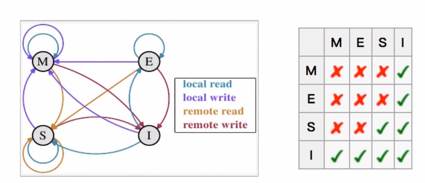
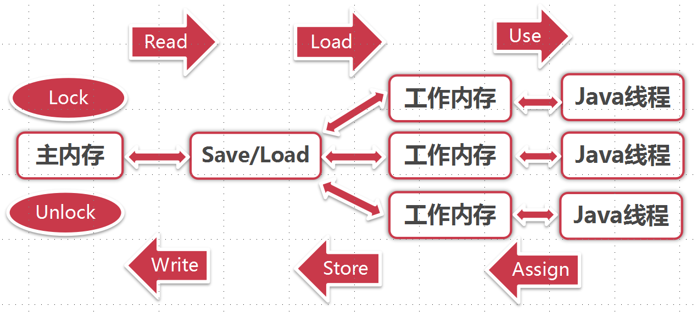

# 并发基础

## 一、CPU多级缓存

为什么需要CPU cache : CPU的频率太快了，快到主存跟不上 ，这样在处理器时钟周期内 ，CPU常常需要等待主存，浪费资源。
所以cache的出现，是为了缓解CPU和内存之间速度的不匹配问题 ( 结构 : `cpu -> cache -> memory` ) .

CPU cache有什么意义 :

1 ) 时间局部性 : 如果某个数据被访问，那么在不久的将来它很可能被再次访问；

2 ) 空间局部性 : 如果某个数据被访问，那么与它相邻的数据很快也可能被访问 ；

## 二、缓存一致性(MESI)

用于保证CPU cache之间缓存共享数据的一致。

**CPU多级缓存的乱序执行优化**。

即处理器为提高运算速度而做出违背代码原有顺序的优化。

## 三、Java内存模型

**Java内存模型规定了一个线程如何和何时可以看到其他线程修改后的共享变量的值，以及在必须时如何同步的访问共享变量**。

JMM

硬件里面的主内存，CPU，以及高速缓冲等:

 

JMM和硬件的基本关系:　

Java内存模型抽象结构图:

 

## 四、8种同步操作和

8中同步操作：

* `lock` ( 锁定 ) : 作用于主内存的变量，把一个变量标识为一条线程独占状态；
* `unlock` ( 解锁 ) : 作用于主内存的变量，把一个处于锁定状态的变量释放出来，释放后的变量才可以被其他线程锁定；
* `read` ( 读取 ) : 作用于主内存的变量，把一个变量值从主内存传输到线程的工作内存中，以便随后的load动作使用；
* `load` ( 载入 ) : 作用于工作内存的变量，它把read操作从主内存中得到的变量值放入工作内存的变量副本中；
* `use` ( 使用) : 作用于工作内存的变量，把工作内存中的一个变量值传递给执行引擎；
* `assign` ( 歧值 ) : 作用于工作内存的变量，它把一个从执行引擎接收到的值赋值给工作内存的变量；
* `store` ( 存储 ) : 作用于工作内存的变量，把工作内存中的一个变量的值传送到主内存中，以便随后的write的操作；
* `write` ( 写入 ) : 作用于主内存的变量，它把store操作从工作内存中一个变量的值传送到主内存的变量中；

同步规则: 

* 如果要把一个变量从主内存中复制到工作内存，就需要按顺寻地执行read和load操作 ，如果把变量从工作内存中同步回主内存中，就要按顺序地执行store和write操作。但Java内存模型只要求上述操作必须按顺序执行，而没有保证必须是连续执行。
* 不允许read和load、store和write操作之一单独出现；
* 不允许一个线程丢弃它的最近`assign`的操作，即变量在工作内存中改变了之后必须同步到主内存中；
* 不允许一个线程无原因地 ( 没有发生过任何assign操作 ) 把数据从工作内存同步回主内存中；
* 一个新的变量只能在主内存中诞生，不允许在工作内存中直接使用一个未被初始化 ( load或assign ) 的变量。即就是对一个变量实施use和store操作之前，必须先执行过了assign和load操作；
* 一个变量在同一时刻只允许一条线程对其进行lock操作，但lock操作可以被同一条线程重复执行多次，多次执行lock后，只有执行相同次数的unlock操作，变量才会被解锁。lock和unlock必须成对出现；
* 如果对一个变量执行lock操作，将会清空工作内存中此变量的值, 在执行引擎使用这个变量前需要重新执行load或assign操作初始化变量的值；
* 如果一个变量事先没有被lock操作锁定，则不允许对它执行unlock操作 ; 也不允许去unlock一个被其他线程锁定的变量；
* 对一个变量执行unlock操作之前，必须先把此变量同步到主内存中 ( 执行store和write操作 )；

