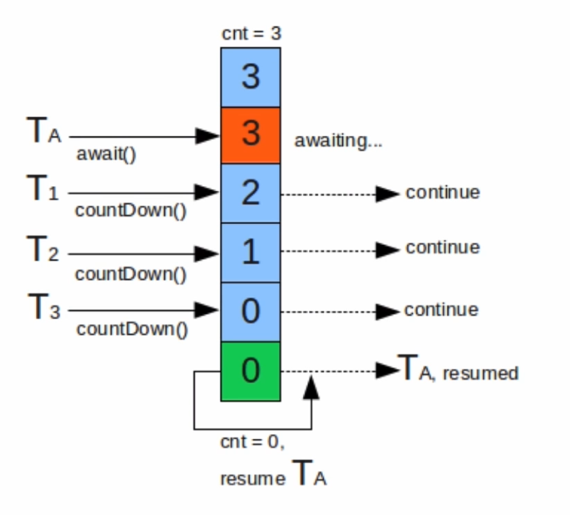
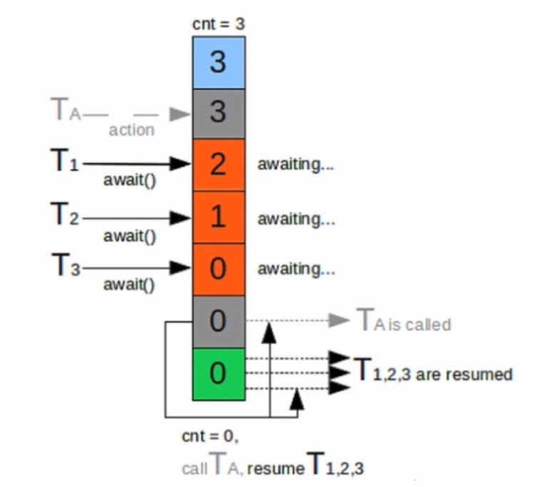
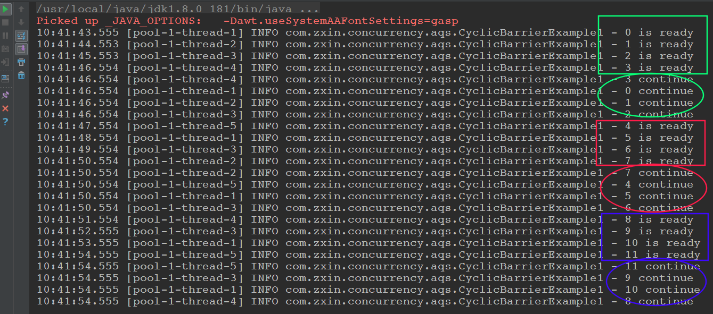
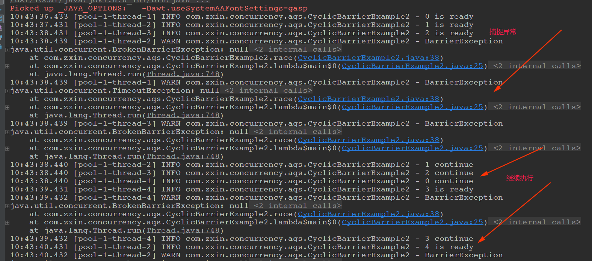
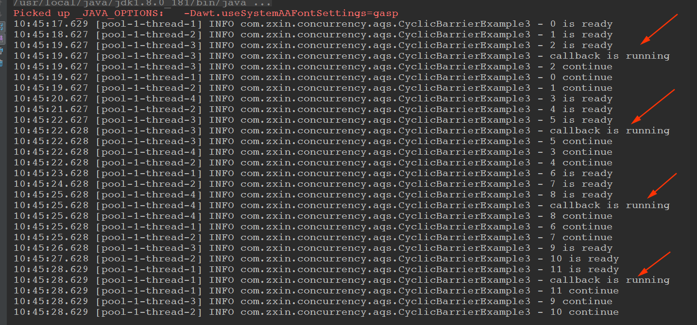
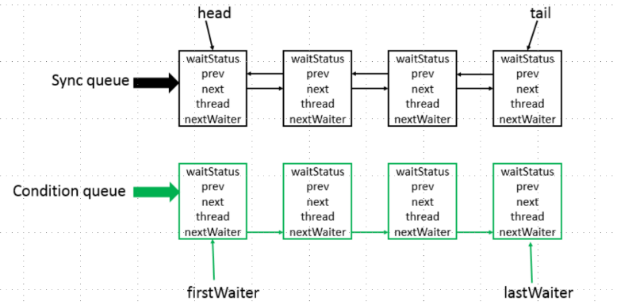
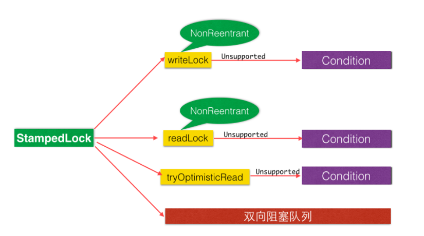

# AQS组件相关

AQS内部维护一个队列


## 一、CountDownLatch



案例: 

```java
@Slf4j
public class CountDownLatchDemo {

    private final static int threadCount = 200;

    public static void main(String[] args) throws InterruptedException {

        ExecutorService service = Executors.newCachedThreadPool();

        CountDownLatch countDownLatch = new CountDownLatch(threadCount);

        for(int i = 0; i < threadCount; i++){
            final int threadNum = i;
            service.execute(() -> {
                try{
                    test(threadNum);
                }catch (Exception e){
                    log.error("exception", e);
                }finally {
                    countDownLatch.countDown();
                }
            });
        }

        // 等待上面的都要执行完，才会执行下面的逻辑，有一点join的意思
        countDownLatch.await();  //这里还可以指定等待的时间，如果超过这个时间，就可以执行下面的逻辑了

        log.info("finish!");

        service.shutdown();
    }

    private static void test (int threadNum) throws InterruptedException {
        Thread.sleep(100);

        log.info("{}", threadNum);

        Thread.sleep(100);
    }
}

```

执行结果:


## 二、Semaphore

用于: **仅能提供有限访问的资源**。

比如: 项目中的数据库，连接数只能是20个，如果上层应用远远大于20，如果同时对数据库进行操作，可能会导致异常，这时就可以通过Semaphore做**并发访问控制**。

案例一:

```java
@Slf4j
public class SemaphoreDemo {

    private final static int threadCount = 20;

    public static void main(String[] args) throws Exception {

        ExecutorService exec = Executors.newCachedThreadPool();

        final Semaphore semaphore = new Semaphore(3);

        for (int i = 0; i < threadCount; i++) {
            final int threadNum = i;
            exec.execute(() -> {
                try {
                    semaphore.acquire(); // 获取一个许可
                    test(threadNum);
                    semaphore.release(); // 释放一个许可
                } catch (Exception e) {
                    log.error("exception", e);
                }
            });
        }
        exec.shutdown();
    }

    private static void test(int threadNum) throws Exception {
        log.info("{}", threadNum);
        Thread.sleep(1000);
    }
}

```

输出(**发现每一秒执行三个**):


再看`tryAcquire()`的使用: 尝试获取一个许可:

```java
/**
 * tryAcquire()尝试获取一个许可
 */
@Slf4j
public class SemaphoreExample2 {

    private final static int threadCount = 20;

    public static void main(String[] args) throws Exception {

        ExecutorService exec = Executors.newCachedThreadPool();

        final Semaphore semaphore = new Semaphore(3);

        for (int i = 0; i < threadCount; i++) {
            final int threadNum = i;
            exec.execute(() -> {
                try {
                    if (semaphore.tryAcquire()) { // 尝试获取一个许可
                        test(threadNum);
                        semaphore.release(); // 释放一个许可
                    }
                } catch (Exception e) {
                    log.error("exception", e);
                }
            });
        }
        exec.shutdown();
    }

    private static void test(int threadNum) throws Exception {
        log.info("{}", threadNum);
        Thread.sleep(1000);
    }
}

```

注意观察输出:


另外`tryAcquire()`也可以指定尝试获取许可的等待时间，超过这个时间就不等待了。

```java
if (semaphore.tryAcquire(5000, TimeUnit.MILLISECONDS)) { // 尝试获取一个许可
```

## 三、CyclicBarrier



和`CountDownLatch`的区别:

`CountDownLatch`和`CyclicBarrier`都能够实现线程之间的等待，只不过它们侧重点不同：

* `CountDownLatch`一般用于某个线程A等待若干个其他线程执行完任务之后，它才执行；
* 而`CyclicBarrier`一般用于一组线程互相等待至某个状态，然后这一组线程再同时执行；
* 另外，`CountDownLatch`是不能够重用的，而`CyclicBarrier`是可以重用的。

CyclicBarrier案例一 (线程之间相互等待):

```java

@Slf4j
public class CyclicBarrierExample1 {

    private final static int threadCount = 12;

    // 指定为5个， 线程之间相互协作
    private static CyclicBarrier barrier = new CyclicBarrier(4);

    public static void main(String[] args) throws Exception {

        ExecutorService executor = Executors.newCachedThreadPool();

        for (int i = 0; i < threadCount; i++) {
            final int threadNum = i;
            Thread.sleep(1000);
            executor.execute(() -> {
                try {
                    race(threadNum);
                } catch (Exception e) {
                    log.error("exception", e);
                }
            });
        }
        executor.shutdown();
    }

    private static void race(int threadNum) throws Exception {
        Thread.sleep(1000);
        log.info("{} is ready", threadNum);

        barrier.await();
        log.info("{} continue", threadNum);
    }
}

```

输出:



案例二:

```java
// await指定等待的时间，超过这个时间就继续执行下面的，这里面可能会抛出异常
@Slf4j
public class CyclicBarrierExample2 {

    private static CyclicBarrier barrier = new CyclicBarrier(5);

    public static void main(String[] args) throws Exception {

        ExecutorService executor = Executors.newCachedThreadPool();

        for (int i = 0; i < 10; i++) {
            final int threadNum = i;
            Thread.sleep(1000);
            executor.execute(() -> {
                try {
                    race(threadNum);
                } catch (Exception e) {
                    log.error("exception", e);
                }
            });
        }
        executor.shutdown();
    }

    private static void race(int threadNum) throws Exception {
        Thread.sleep(1000);
        log.info("{} is ready", threadNum);
        try {
            barrier.await(2000, TimeUnit.MILLISECONDS);
        } catch (Exception e) {
            log.warn("BarrierException", e);
        }
        log.info("{} continue", threadNum);
    }
}

```

输出:



案例三(开头执行的任务)

```java
// 可以在一开始放置一个任务, 这个任务会在每一次的开头执行
@Slf4j
public class CyclicBarrierExample3 {

    // 初始化的时候放置一个任务
    private static CyclicBarrier barrier = new CyclicBarrier(3, () -> {
        log.info("callback is running");
    });

    public static void main(String[] args) throws Exception {

        ExecutorService executor = Executors.newCachedThreadPool();

        for (int i = 0; i < 12; i++) {
            final int threadNum = i;
            Thread.sleep(1000);
            executor.execute(() -> {
                try {
                    race(threadNum);
                } catch (Exception e) {
                    log.error("exception", e);
                }
            });
        }
        executor.shutdown();
    }

    private static void race(int threadNum) throws Exception {
        Thread.sleep(1000);
        log.info("{} is ready", threadNum);
        barrier.await();
        log.info("{} continue", threadNum);
    }
}
```

输出:



## 四、ReentrantLock

性能较好的原因: **避免了使线程进入内核态的阻塞状态**。

独有的功能:

* 可以指定是公平锁还是非公平锁；
* 提供了一个Condition类，可以分组唤醒需要唤醒的线程；
* 提供能够中断等待锁的线程机制，即`lock.lockInterruptibly()`。

ReentrantLock的简单使用就不举例了。

结合Condition使用（维护一个锁的队列和条件等待队列）（一上一下）



代码:

```java
@Slf4j
public class LockExample6 {

    public static void main(String[] args) {
        ReentrantLock reentrantLock = new ReentrantLock();
        Condition condition = reentrantLock.newCondition();

        new Thread(() -> {
            try {
                reentrantLock.lock();
                log.info("wait signal"); // 1
                condition.await();
            } catch (InterruptedException e) {
                e.printStackTrace();
            }
            log.info("get signal"); // 4
            reentrantLock.unlock();
        }).start();

        new Thread(() -> {
            reentrantLock.lock();
            log.info("get lock"); // 2
            try {
                Thread.sleep(3000);
            } catch (InterruptedException e) {
                e.printStackTrace();
            }
            condition.signalAll();
            log.info("send signal ~ "); // 3
            reentrantLock.unlock();
        }).start();
    }
}

```

输出:


## 五、ReentrantReadWriteLock、StampedLock

下面看其中一个`ReentrantReadWriteLock`例子:

```java
@Slf4j
public class LockExample3 {

    private final Map<String, Data> map = new TreeMap<>();

    private final ReentrantReadWriteLock lock = new ReentrantReadWriteLock();

    private final Lock readLock = lock.readLock();

    private final Lock writeLock = lock.writeLock();

    public Data get(String key) {
        readLock.lock();
        try {
            return map.get(key);
        } finally {
            readLock.unlock();
        }
    }

    public Set<String> getAllKeys() {
        readLock.lock();
        try {
            return map.keySet();
        } finally {
            readLock.unlock();
        }
    }

    public Data put(String key, Data value) {
        writeLock.lock();
        try {
            return map.put(key, value);
        } finally {
            readLock.unlock();
        }
    }

    class Data {

    }
}

```

 StampedLock是Java8引入的一种新的所机制，简单的理解，**可以认为它是读写锁的一个改进版本,读写锁虽然分离了读和写的功能,使得读与读之间可以完全并发,但是读和写之间依然是冲突的,读锁会完全阻塞写锁,它使用的依然是悲观的锁策略.如果有大量的读线程,他也有可能引起写线程的饥饿**。

 **而StampedLock则提供了一种乐观的读策略,这种乐观策略的锁非常类似于无锁的操作,使得乐观锁完全不会阻塞写线程**

原码解析文章: <https://www.cnblogs.com/huangjuncong/p/9191760.html>



代码:

```java
@Slf4j
@ThreadSafe
public class LockExample5 {

    // 请求总数
    public static int clientTotal = 5000;

    // 同时并发执行的线程数
    public static int threadTotal = 200;

    public static int count = 0;

    private final static StampedLock lock = new StampedLock();

    public static void main(String[] args) throws Exception {
        ExecutorService executorService = Executors.newCachedThreadPool();
        final Semaphore semaphore = new Semaphore(threadTotal);
        final CountDownLatch countDownLatch = new CountDownLatch(clientTotal);
        for (int i = 0; i < clientTotal ; i++) {
            executorService.execute(() -> {
                try {
                    semaphore.acquire();
                    add();
                    semaphore.release();
                } catch (Exception e) {
                    log.error("exception", e);
                }
                countDownLatch.countDown();
            });
        }
        countDownLatch.await();
        executorService.shutdown();
        log.info("count:{}", count);
    }

    private static void add() {
        long stamp = lock.writeLock();
        try {
            count++;
        } finally {
            lock.unlock(stamp); //解锁的时候加上stamp
        }
    }
}

```

