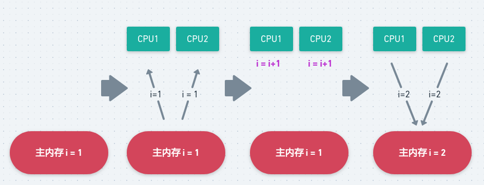
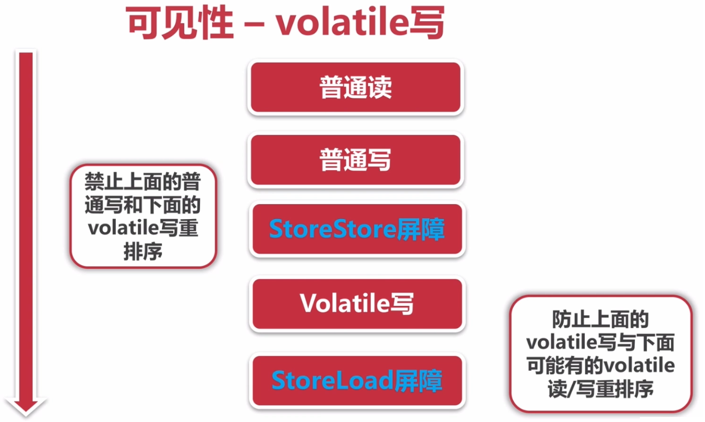
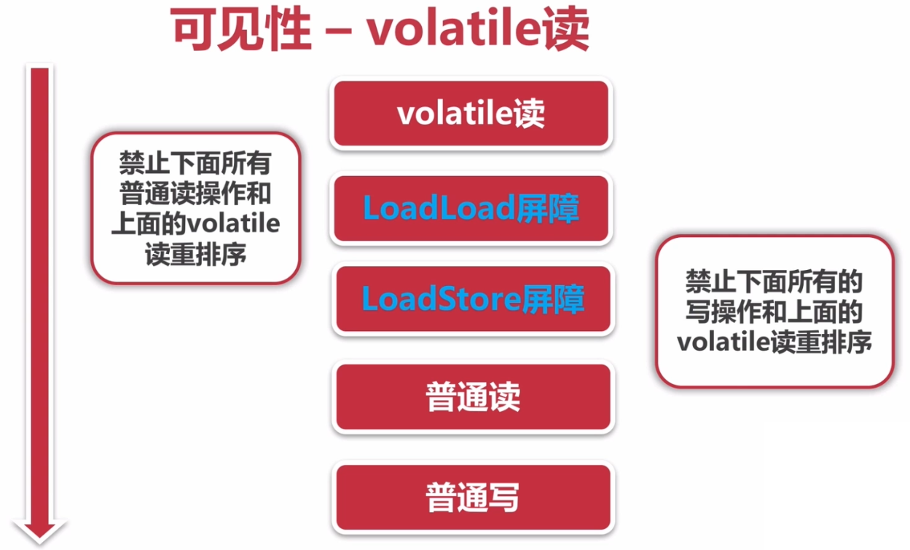
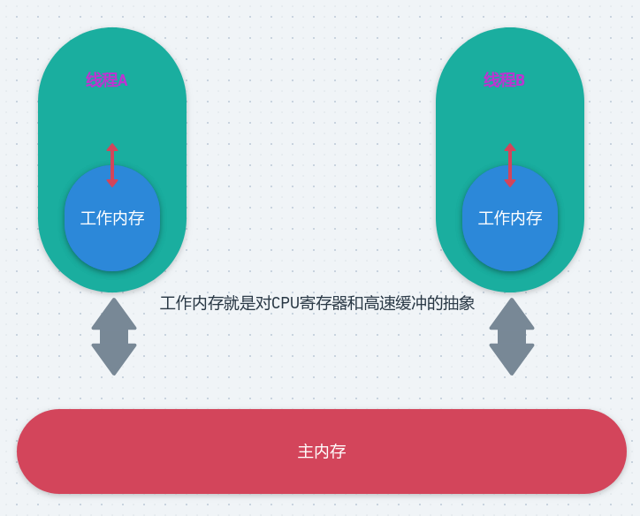

# 并发机制底层实现原理

## 一、本地内存和线程安全问题

### 1、缓存行

CPU不会直接和内存(主存)交互，而是通过总线将数据读到自己的缓存行中。

缓存行: 

- 缓存是分段（line）的，一个段对应一块存储空间，我们称之为缓存行；
- 它是CPU缓存中可分配的最小存储单元，通常来说是64字节；
- 当CPU看到一条读取内存的指令时，它会把内存地址传递给一级数据缓存，一级数据缓存会检查它是否有这个内存地址对应的缓存段，如果没有就把整个缓存段从内存（或更高一级的缓存）中加载进来；

### 2、写缓冲区

CPU不会直接和内存(主存)交互，会将要读取的数据先写入到自己的写缓冲区，随后才会刷新到内存。

### 3、线程安全问题

* 实际中都是由很多CPU来执行并发程序，不同处理器同时执行不同的线程（每个线程都有一个仅对执行自己的处理器可见的本地内存)。
* 所以就会出现主内存中`i = 1`，线程A读取到自己的本地内存`i++`，于此同时线程B也读取到主内存`i= 1`到自己的本地内存执行`i++`，待两个线程的本地内存刷新到主内存时`i = 2`。于是引发了线程安全问题。



线程安全问题总结:

* **线程都是在自己的本地内存中操作共享变量的，仅对执行自己的处理器可见而对其他处理器不可见**。
* 而它们在自己的本地内存对共享变量的更新何时会刷新到主内存、会按照什么顺序刷新到主内存是不可预见的。

## 二、volatile实现原理

总结:

* 对于声明了`volatile`的变量进行写操作的时候，JVM会向处理器发送一条LOCK前缀的指令。会把这个变量所在缓存行的数据写回到主内存中；
* 在多处理器的情况下，保证各个处理器缓存一致性的特点，实现缓存一致性协议；

通过加入**内存屏障**和**禁止重排序优化**实现。

* 对volatile变量写操作时，会在写操作后面加入一条`store`屏障指令，将本地内存中的共享变量值刷新到主内存；
* 对volatile变量读操作时，会在读操作前加入一条load屏障指令，从主内存中读取共享变量；





### 1、volatile语义

使用volatile关键字可以**保证共享变量之间的可见性**，被`volatile`修饰的变量在线程之间就是可见的，能保证变量被一致性的更新。

`volatile`做的两件事:

- 1、锁定缓存行；
  - 在某个处理器将共享数据写入自己的缓冲区 (对应线程对本地内存中的共享记量做修改) 时，会使用缓存锁定其他也读取了该共享记量的缓存行，使其他处理器不能访问该共享专量。 
  - 早期使用的是总线锁定，即一经锁定，其他处理器就不能访问所有共享记量，但是这会影响处理器读写其他共享变量，影响效率。
- 2、刷新内存，保证数据一致性；
  - 该处理器将自己写缓冲区中的所有数据刷新到主内存 (包括非volatile变量) 。
  - 由**缓存一致性协议**来保证其他CPU重新读数据 (其他处理器会通过总线嗅探其他处理器写组冲区中的更改，一经发现就会将自己的缓存行置为无效状态(看自己的是不是过期了)，下次访问数据时需要到主内存中重新读)

一旦一个共享变量（类的成员变量、类的静态成员变量）被`volatile`修饰之后，那么就具备了两层语义：

* 1、保证了不同线程对这个变量进行操作时的可见性，即一个线程修改了某个变量的值，这新值对其他线程来说是立即可见的。
* 2、**禁止进行指令重排序**。

> 由于缓存行为`32`字节宽或者`64`字节宽，因此避免缓存锁定多个共享资源，可以采用**字节填充**的方式来提高对象并发性能。

### 2、Lock前缀指令

加入volatile关键字和没有加入volatile关键字时所生成的汇编代码发现，**加入volatile关键字时，会多出一个lock前缀指令**

lock前缀指令实际上相当于一个**内存屏障**（也称内存栅栏），内存屏障会提供3个功能：

* 1、它确保指令重排序时**不会把其后面的指令排到内存屏障之前的位置**，也不会把前面的指令排到内存屏障的后面；即在执行到内存屏障这句指令时，在它前面的操作已经全部完成；
* 2、**它会强制将对缓存的修改操作立即写入主存**；
* 3、如果是写操作，它会导致其他CPU(处理器)中对应的缓存行无效。

在JVM底层volatile是采用“内存屏障”来实现的。

可以得出lock指令的几个作用：

* 1、锁总线，其它CPU对内存的读写请求都会被阻塞，直到锁释放，不过实际后来的处理器都采用锁缓存替代锁总线，因为锁总线的开销比较大，锁总线期间其他CPU没法访问内存
* 2、lock后的写操作会回写已修改的数据，同时让其它CPU相关缓存行失效，从而重新从主存中加载最新的数据
* 3、不是内存屏障却能完成类似内存屏障的功能，阻止屏障两遍的指令重排序

这种场景下多缓存的数据一致是通过缓存一致性协议来保证的，我们来看一下什么是缓存一致性协议。 

### 3、缓存一致性

`LOCK#`会锁总线，实际上这不现实，因为锁总线效率太低了。因此最好能做到：使用多组缓存，但是它们的行为看起来只有一组缓存那样。缓存一致性协议就是为了做到这一点而设计的，就像名称所暗示的那样，**这类协议就是要使多组缓存的内容保持一致**。

缓存一致性协议有多种，但是日常处理的大多数计算机设备都属于"嗅探（snooping）"协议，基本思想如下: 

* 所有内存的传输都发生在一条共享的总线上，而所有的处理器都能看到这条总线：缓存本身是独立的，但是内存是共享资源，所有的内存访问都要经过仲裁（同一个指令周期中，只有一个CPU缓存可以读写内存）。
* CPU缓存不仅仅在做内存传输的时候才与总线打交道，**而是不停在嗅探总线上发生的数据交换，跟踪其他缓存在做什么。所以当一个缓存代表它所属的处理器去读写内存时，其它处理器都会得到通知，它们以此来使自己的缓存保持同步**。只要某个处理器一写内存，其它处理器马上知道这块内存在它们的缓存段中已**失效**。

### 4、回看volatile原理



工作内存Work Memory其实就是对CPU寄存器和高速缓存的抽象，或者说每个线程的工作内存也可以简单理解为CPU寄存器和高速缓存。

那么当写两条线程`Thread-A`与`Threab-B`同时操作主存中的一个volatile变量`i`时，Thread-A写了变量`i`，那么：

- `Thread-A`发出`LOCK#`指令
- 发出的`LOCK#`指令锁总线（或锁缓存行），同时让`Thread-B`高速缓存中的缓存行内容失效
- `Thread-A`向主存回写最新修改的`i`

`Thread-B`读取变量`i`，那么：

- `Thread-B`发现对应地址的缓存行被锁了，等待锁的释放，缓存一致性协议会保证它读取到最新的值

由此可以看出，volatile关键字的读和普通变量的读取相比基本没差别，差别主要还是在变量的写操作上。

## 三、sychronized实现原理

### 1、Monitor

利用synchronized实现同步的基础，Java中的每一个对象都可以作为锁，有以下3种形式

- 对于普通同步方法，锁是当前实例对象；
- 对于静态同步方法，锁是当前类的Class对象；
- 对于同步方法块，锁住的是synchonized括号里配置的对象；

Java 虚拟机中的同步(Synchronization)是基于进入和退出**Monitor对象**实现， **无论是显式同步(有明确的 monitorenter 和 monitorexit 指令**，即同步代码块)还是隐式同步都是如此。

`monitorenter`指令实在编译后插入到同步代码块的开始位置，而`monitorexit`是插入到方法结束和异常处，每个`monitorenter`必须要有对应的额`monitorexit`与之配对，任何对象都有`monitor`与之关联。

线程只有持有到`monitor`，才会属于锁定状态，线程会尝试获取对象对应的`monitor`的所有权，即尝试获得对象的锁。

在 Java 语言中，同步用的最多的地方可能是被 synchronized 修饰的同步方法。**同步方法并不是由monitorenter 和 monitorexit 指令来实现同步的，而是由方法调用指令读取运行时常量池中方法的 ACC_SYNCHRONIZED 标志来隐式实现的**。

```java
1    public void add(Object obj){
2        synchronized (obj){
3            //do something
4        }
5    }

反编译后：
 1public class com.zxin.thread.SynchronizedDemo {
 2  public com.wuzy.thread.SynchronizedDemo();
 3    Code:
 4       0: aload_0
 5       1: invokespecial #1              
 6       4: return
 7
 8  public void add(java.lang.Object);
 9    Code:
10       0: aload_1
11       1: dup
12       2: astore_2
13       3: monitorenter //进入同步方法
14       4: aload_2
15       5: monitorexit //退出同步方法
16       6: goto          14
17       9: astore_3
18      10: aload_2
19      11: monitorexit //退出同步方法
20      12: aload_3
21      13: athrow
22      14: return
23    Exception table:
24       from    to  target type
25           4     6     9   any
26           9    12     9   any
27}
```

看下第13行~15行代码**，发现同步代码块是使用monitorenter和monitorexit指令来进行代码同步的,注意看第19行代码，为什么会多出一个monitorexit指令，主要是JVM为了防止代码出现异常**，也能正确退出同步方法。

同步方法并不是用`monitorenter`和`monitorexit`指令来进行同步的，实际上同步方法会被翻译成普通的方法调用和返回指令如:invokevirtual、areturn指令，在VM字节码层面并没有任何特别的指令来实现被synchronized修饰的方法，而是**在Class文件的方法表中将该方法的access_flags字段中的synchronized标志位置设为1**，表示该方法是同步方法并使用调用该方法的对象或该方法所属的Class在JVM的内部对象表示做为锁对象。

总结: 

* 同步代码块: 使用`monitorenter`和`monitorexit`；
* 同步方法: 使用方法修饰符`ACC_ASYNCHRONIZED`。

### 2、Java对象头

在JVM内存中，对象在内存中的布局分为`3`块: **对象头、实例数据和对其填充**。

其中对象头包括 : `Mark Word、Class Meta Data、Array Length`。

* `Mark Word`: 锁标志位等跟锁有关的信息，2个字节存储(数组则3个)；
* `Class Meta Data`: 对象所属类的类元数据信息；
* `Array Length` : 对象为数组类型时才有，记录了数组长度；

Mark Word的状态变化:


锁标志的意义:

* 锁标识`lock == 00`标识轻量级锁；
* 锁标识`lock = 10`标识重量级锁；
* 偏向锁标识`biased_lock = 1`表示偏向锁；
* 偏向锁标识`biased_lock = 0`且锁标识`=01`表示无锁状态；

### 3、锁的升级

锁的状态: **无锁、偏向锁、轻量级锁、重量级锁**。

锁升级: **JVM检测到不同的竞争状态时，自动切换到合适的锁实现**。

**无锁**:

* 初始情况(没有任何线程访问过同步块)；

**偏向锁**:

* 大多数场景不会出现多线程并发访问共享资源的情况，针对并发强度小的情况，引入了偏向锁，在一个线程访问同步块时有如下操作: 
  * 1、判断对象头的`Mark Word`中的线程ID是否指的就是当前线程，如果是，直接进入同步块，如果不是，进入步骤`2`；
  * 2、如果对象头的`Mark Word`中的线程ID不是指向当前线程，那么查看Mark Word中"是否是偏向锁"这一标志位。如果是`1`，指向步骤`3`；否则表示是无锁状态，CAS将Mard Word 中的线程ID指向当前线程，进入同步块；
  * 3、如果是`1`就说明是偏向锁，而且出现了锁争用的情况，偏向锁升级为轻量级锁；
* 偏向锁撤销
  * 由于偏向锁是"偏向"某一个线程的，如果线程"挂了"怎么办？这就需要偏向锁撤销机制；
  * 即在一个安全点（没有字节码执行），首先暂停锁"偏向"的线程，然后检查线程状态，如果线程"挂了"那么将锁置为无锁状态；

**轻量级锁**:

* 获取锁
  * 1、首先将同步对象(synchronize内的对象)的Mark Word复制一份到当前线程栈桢的一块空间中，并使用CAS将同步对象的Mark Word更新为指向该空间的指针，如果更新成功那么成功获取锁；否则CAS自旋；
  * 2、获取锁的线程在执行完同步块释放锁时，CAS将同步对象的Mark Word替换回占中原先保存的Mark Word，如果成功，则表示成功释放锁，没有竞争发生。否则表明当前锁存在竞争，升级为重量级锁；

**重量级锁(排他锁)**:

* 想进入同步快需要获取对象的`monitor`，退出时释放`monitor`。
* 获取对象`monitor`时如果`monitor`已被持有，则该线程将进入`monitor`的阻塞队列，直到`monitor`被释放，`monitor`阻塞队列上的线程将开启一轮新的竞争。

## 四、原子操作实现原理

### 1、处理器实现原子操作

1、使用总线锁保证原子性

所谓总线锁就是使用处理器提供的一个`LOCK＃`信号，当一个处理器在总线上输出此信号时，其他处理器的请求将被阻塞住，那么该处理器可以独占使用共享内存。

2、使用缓存锁保证原子性

所谓“**缓存锁定**”就是如果缓存在处理器缓存行中内存区域在LOCK操作期间被锁定，当它执行锁操作回写内存时，处理器不在总线上声言`LOCK＃`信号，**而是修改内部的内存地址，并允许它的缓存一致性机制**来保证操作的原子性；

### 2、Java实现原子操作

两种方式：**锁和循环CAS**

CAS全称`Compare-and-Swap`（比较并交换），JVM中的CAS操作是依赖处理器提供的`cmpxchg`指令完成的，CAS指令中有3个操作数，分别是内存位置V、旧的预期值A和新值B。

当CAS指令执行时，**当且仅当内存位置V符合旧预期值时A时，处理器才会用新值B去更新V的值，否则就不执行更新，但是无论是否更新V，都会返回V的旧值，该操作过程就是一个原子操作**

JDK1.5之后才可以使用CAS，由`sun.misc.Unsafe`类里面的`compareAndSwapInt()`和`compareAndSwapLong()`等方法包装实现，虚拟机在即时编译时，对这些方法做了特殊处理，会编译出一条相关的处理器CAS指令

> CAS就是Compare And Swap，涉及到两个术语: 预期值、更新值。在对内存中的值进行更新时，拿A和B两线程同时对`i`变量进行`i++`举例:
>
> 首先A线程读到`i`的值为1，执行`i++`操作并刷新到主内存时，比较一下主内存中的还是不是1 (预期值) ，如果是就将共享记量替换为2 (更新值) 。
>
> 后来B也准备将`i= 2`刷新到主内存时，发现主内存中的不等于1 (预期值) ，于是更新失败，重新读取`i=2`，进行CAS更新，这个不断尝试CAS更新的过程称为自旋。

**CAS实现原子操作的三大问题**

**1、ABA问题**：初次读取内存旧值时是A，再次检查之前这段期间，如果内存位置的值发生过从A变成B再变回A的过程，我们就会错误的检查到旧值还是A，认为没有发生变化，其实已经发生过A-B-A得变化，这就是CAS操作的ABA问题

解决方法：使用版本号，即`1A-2B-3A`，这样就会发现1A到3A的变化，不存在ABA变化无感知问题，JDK的atomic包中提供一个带有标记的原子引用类`AtomicStampedReference`来解决ABA问题

**2、循环时间长开销大**：自旋CAS如果长时间不成功，会给CPU带来非常大的执行开销

**3、只能保证一个共享变量的原子操作**：当对一个共享变量执行操作时，可以使用循环CAS来保证原子操作，但是多个共享变量操作时，就无法保证了

解决方法：

- 将多个变量**组合成一个共享变量**，jdk提供了`AtomicReference`类来保证引用对象之间的原子性，那么就可以把多个变量放在一个对象里来进行CAS操作
- 使用锁

>除了偏向锁，JVM实现锁的方式都用了循环CAS，即当一个线程想进入同步块的时候使用循环CAS的方式来获取锁，当它退出同步块的时候使用循环CAS释放锁。