# MySQL基础
 - [一、数据库的基本操作](#一数据库的基本操作)
    - [1、基本命令](#1基本命令)
    - [2、数据库储存引擎](#2数据库储存引擎)
 - [二、数据表的基本操作](#二数据表的基本操作)
    - [1、创建数据表](#1创建数据表)
    - [2、修改数据表](#2修改数据表)
    - [3、删除数据表](#3删除数据表)
    - [4、综合案例小结](#4综合案例小结)
 - [三、数据类型和运算符](#三数据类型和运算符)
     - [1、MYSQL数据类型介绍](#1mysql数据类型介绍)
     - [2、如何选择数据类型](#2如何选择数据类型)
     - [3、常见运算符介绍](#3常见运算符介绍)
 - [四、Mysql函数](#四mysql函数)
      - [1、数学函数](#1数学函数)
      - [2、字符串函数](#2字符串函数)
      - [3、日期和时间函数](#3日期和时间函数)
      - [4、条件判断函数](#4条件判断函数)
      - [5、系统信息函数](#5系统信息函数)
      - [6、加/解密函数](#6加解密函数)
      - [7、其他函数](#7其他函数)
      - [8、综合案列-Mysql函数的使用](#8综合案列-mysql函数的使用)
***
## 一、数据库的基本操作
### 1、基本命令
**登陆数据库命令:**
```mysql
mysql -h localhost -u root -p
```
**创建数据库命令:**
```sql
create database test_db;
```
**查看已经创建的数据库的定义**
```mysql
show create database test_db;
```
**查看已经存在的所有数据库:**
```mysql
show databases;
```
**删除数据库**

```sql
drop database test_db;
```
注意删除数据库时要小心，不会给出提示，数据和数据表会一同删除。


### 2、数据库储存引擎

#### 1)、查看引擎命令
使用如下命令查看系统所支持的引擎类型:

```mysql
show engines;
```

#### 2)、InnoDB引擎

InnoDB 是事务型数据库的首选引擎，**支持事务安全表 (ACID ) ，支持行锁定和外键。**

InnoDB 作为**默认存储引擎**，特性有:

*  InnoDB 给 MySQL 提供了**具有提交、回滚和崩溃恢复能力的事务安全 (ACID 兼容)存储引擎**。InnoDB 锁定在**行级**并且也在 SELECT 语句中提供一个类似 Oracle 的**非锁定读**。这些功能增加了多用户部署和性能。在 SQL 查询中，可以自由地将 **InnoDB 类型的表与其他MySQL 的表的类型混合起来**，甚至在同一个查询中也可以混合。
*  InnoDB 是**为处理巨大数据量的最大性能设计**。它的 CPU 效率可能是任何其他基于磁盘的关系数据库引擎所不能匹敌的。
*  InnoDB 存储引擎完全与 MySQL 服务器整合，**InnoDB 存储引擎为在主内存中缓存数据和索引而维持它自己的缓冲池**。InnoDB **将它的表和索引存在一个逻辑表空间中，表空间可以包含数个文件〈或原始磁盘分区) 。**这与 MyISAM 表不同，比如在 `MyISAM` 表中每个表被存在分离的文件中。InnoDB 表可以是任何尺寸，即使在文件尺寸被限制为 2GB 的操作系统上。
*  InnoDB **支持外键完整性约束 (FOREIGN KEY)** 。存储表中的数据时, 每张表的存储都按主键顺序存放, 如果没有显示在表定义时指定主键，InnoDB 会为每一行生成一个 6B 的ROWID，并以此作为主键。
*  InnoDB 被用在众多需要高性能的大型数据库站点上。
*  InnoDB 不创建目录，使用 InnoDB 时，MySQL 将在 MySQL 数据目录下创建一个名为`ibdata1` 的 10MB 大小的自动扩展数据文件，以及两个名为` ib_logfile0` 和` ib_logfilel `的 `5MB`大小的日志文件。

InnoDB 不创建目录，使用 InnoDB 时，MySQL 将在 MySQL 数据目录下创建一个名为
ibdatal 的 10MB 大小的自动扩展数据文件，以及两个名为 ib_logfile0 和 ib_logfilel 的 SMB
大小的日志文件。

#### 3)、MyISAM引擎

MyISAM 基于 ISAM 的存储引擎，并对其进行扩展。它是在 **Web、数据存储**和其他应用
环境下最常使用的存储引擎之一。MyISAM 拥有较高的插入、查询速度，**但不支持事务**。在
MyISAM 主要特性有:

* **大文件** (达 63 位文件长度) 在支持大文件的文件系统和操作系统上被支持。
* 当把删除、更新及插入操作混合使用的时候，动态尺寸的行产生更少碎片。这要通过合并相邻被删除的块，以及若下一个块被删除，就扩展到下一块来自动完成。
* 每个 MyISAM 表最大索引数是 64，这可以通过重新编译来改变。每个索引最大的列数是 16 个。
* 最大的键长度是 1000B，这也可以通过编译来改变。对于键长度超过 250B 的情况，一个超过 1024B 的键将被用上。
* **BLOB 和TEXT 列可以被索引**。
* **NULL 值被允许在索引的列中。这个值占每个键的 0~1 个字节**。
* 所有数字键值以高字节优先被存储以允许一个更高的索引压缩。
* 每表一个`AUTO_INCREMENT` 列的内部处理。MyISAM 为 `INSERT` 和 `UPDATE` 操作自动更新这一列。这使得 `AUTO_INCREMENT `列更快〈至少 10%) 。在序列顶的值被删除之后就不能再利用。
* 可以把**数据文件和索引文件**放在不同目录。
* 每个字符列可以有不同的字符集。
* 有VARCHAR 的表可以固定或动态记录长度。
* VARCHAR 和CHAR 列可以多达 64KB。

> 使用 MyISAM 引擎创建数据库，将生产 3 个文件。文件的名字以**表的名字**开始，扩展名指出文件类型， `frm`文件存储表定义，数据文件的扩展名为`.MYD (MYData)`，索引文件的扩展名是`.MYI MYIndex)` 。

#### 4)、MEMORY引擎

MEMORY 存储引擎**将表中的数据存储到内存中，为查询和引用其他表数据提供快速访问**。MEMORY 主要特性有:

* MEMORY 表的每个表可以有多达 32 个索引，每个索引 16 列，以及 500B 的最大键长度。     
* MEMORY 存储引擎执行 **HASH 和 BTREE** 索引。
* 可以在一个MEMORY 表中有非唯一键。
* MEMORY 表使用一个固定的记录长度格式。
* MEMORY 不支持BLOB 或TEXT 列。
* MEMORY 支持 `AUTO_INCREMENT` 列和**对可包含NULL 值的列的索引**。
* MEMORY 表在所有客户端之间共享 (就像其他任何非 TEMPORARY 表) 。
* **MEMORY 表内容被存在内存中，内存是 MEMORY 表和服务器在查询处理时的空闲中创建的内部表共享**。
* 当不再需要 MEMORY 表的内容时，**要释放被 MEMORY 表使用的内存**，应该执行`DELETE FROM` 或TRUNCATE TABLE，或者删除整个表 〈使用DROP TABLE) 。

#### 5)、存储引擎的选择</font>

不同存储引擎都有各自的特点，以适应不同的需求。下面是各种引擎的不同的功能:


* 如果要提供提交、回滚和崩溃恢复能力的**事务安全** (ACID 兼容) 能力，并要求实现**并发控制**，InnoDB 是个很好的选择；

* 如果数据表主要用来**插入和查询记录**，则 MyISAM 引擎能提供较**高的处理效率**；

* 如果只是**临时存放数据**，数据量不大，并且**不需要较高的数据安全性**，可以选择将**数据保存在内存中**的 Memory 引擎，MySQL 中使用该引擎作为临时表，存放查询的中间结果；

* 如果只有 **INSERT 和 SELECT 操作**，可以选择 Archive 引擎，Archive 存储引擎支持高并发的插入操作，但是本身**并不是事务安全**的。Archive 存储引擎非常适合**存储归档数据**，如记录日志信息可以使用 Archive 引擎。

使用哪一种引擎要根据需要灵活选择, 一个数据库中多个表可以使用不同引擎以满足各种性能和实际需求。使用合适的存储引擎，将会提高整个数据库的性能。

>  顺便说一下`Mysql`中单行注释是`#`，而不是`--`。

#### 全文检索(Full-text Search)
将 **非结构化数据** 中的一部分信息提取出来，重新组织，使其变得有一定结构，然后对此有一定结构的数据进行搜索，从而达到搜索相对较快的目的。这部分从非结构化数据中提取出的然后重新组织的信息，我们称之索引。

例如：字典。字典的拼音表和部首检字表就相当于字典的索引，对每一个字的解释是非结构化的，如果字典没有音节表和部首检字表，在茫茫辞海中找一个字只能顺序扫描。然而字的某些信息可以提取出来进行结构化处理，比如读音，就比较结构化，分声母和韵母，分别只有几种可以一一列举，于是将读音拿出来按一定的顺序排列，每一项读音都指向此字的详细解释的页数。我们搜索时按结构化的拼音搜到读音，然后按其指向的页数，便可找到我们的非结构化数据——也即对字的解释。

这种先建立索引，再对索引进行搜索的过程就叫全文检索(Full-text Search)。
虽然创建索引的过程也是非常耗时的，但是索引一旦创建就可以多次使用，全文检索主要处理的是查询，所以耗时间创建索引是值得的。


**倒排索引结构也叫反向索引结构，包括索引和文档两部分，索引即词汇表，它的规模较小，而文档集合较大。**

***

## 二、数据表的基本操作

### 1、创建数据表

```mysql
use test_db;
create table tb_emp1
(
	id int(11),
	name varchar(15),
	deptID int(11),
	salary 	float
);
```
使用下面语句查看此数据库存在的表
```mysql
show tables;
```
#### 1)、主键约束

>  主键，又称主码，是表中**一列或多列的组合**。主键约束〈Primary Key Constraint) 要求**主键列的数据唯一，并且不允许为空`!= null`**。主键能够唯一地标识表中的一条记录，可以结合外键**来定义不同数据表之间的关系**， 并且可以加快数据库查询的速度。主键和记录之间的关系如同身份证和人之间的关系，它们之间是一一对应的。主键分为两种类型: **单字段主键和多字段联合主键。**

 - 单字段主键；
 - 在定义完所有列之后定义主键；
 - 多字段联合主键；

单字段约束:
```mysql
create table tb_emp2
(
	id int(11) primary key,
	name varchar(15),
	deptID int(11),
	salary 	float
);
```
后面约束:
```mysql
create table tb_emp3
(
	id int(11),
	name varchar(15),
	deptID int(11),
	salary 	float,
	primary key(id)
);
```
联合约束：假设没有主键`id`，可以通过`name`和`deptID`来确定一个唯一的员工。

```mysql
create table tb_emp4
(
	id int(11),
	name varchar(15),
	deptID int(11),
	salary 	float,
	primary key(name,deptID)
);
```
#### 2)、外键约束

* 外键用来在两个表的数据之间建立链接， 它可以是一列或者多列。一个表可以有一个或多个外键。**外键对应的是参照完整性**，一个表的外键可以为空值，**若不为空值，则每一个外键值必须等于另一个表中主键的某个值。**
* 外键 : 首先它是表中的一个字段，**它可以不是本表的主键，但对应另外一个表的主键。外键主要作用是保证数据引用的完整性， 定义外键后**，不允许删除在另一个表中具有关联关系的行。外键的作用是保持数据的一致性、完整性。例如，部门表 `tb_dept `的主键是`id`，在员工表`tb_emp5`中有一个键 `deptId` 与这个` id` 关联。

有关主表和从表:

* 主表(父表) : 对于两个具有关联关系的表而言，相关联字段中**主键所在的那个表**即是主表。

* 从表(子表) : 对于两个具有关联关系的表而言，相关联字段中**外键所在的那个表**即是从表。

需要注意:

 - <u>子表的外键必须要关联父表的**主键**</u>；
 - **相关联的数据类型必须匹配**；
 - **先删子表，再删父表**；

下面的例子**tb_emp5(员工表)中的deptID关联部门表中的ID(主键)**：
```mysql
//父表
create table tb_dept1
(
	id int(11)primary key,
	name varchar(22) not null,
	location varchar(50)
)
```

```mysql
//子表
create table tb_emp5
(
	id int(11) primary key,
	name varchar(25),
	deptID int(11),
	salary float,
	constraint fk_emp5_dept foreign key(deptID) references tb_dept1(id)
)
```
#### 3)、非空约束

非空约束指定的字段不能为空，如果添加数据的时候没有指定值，会报错。

```mysql
create table tb_emp6
(
	id int(11) primary key,
	name varchar(15) not null,
	deptID int(11),
	salary 	float
);
```
#### 4)、唯一性约束

* 唯一性要求该列唯一；
* **允许为空，但只能出现一个空值；**
* 唯一性可以确保一列或几列不出现重复值；

```mysql
create table tb_dept2
(
	id int(11)primary key,
	name varchar(22) unique,
	location varchar(50)
);
```
```mysql
create table tb_dept3
(
	id int(11)primary key,
	name varchar(22),
	location varchar(50),
	constraint N_uq unique(name)  #N_uq是约束名
);
```
**注意`UNIQUE`和主键约束(`PRIMARY KEY `)的区别:**

*  <u>一个表中可以有多个字段声明为`UNIQUE`，但只能有一个`PRIMARY KEY` 声明；</u>
*  <u>声明为 `PRIMAY KEY` 的列不允许有空值，但是声明为 `UNIQUE`的字段允许空值 (NULL) 的存在。</u>

#### 5)、默认约束

指定了默认约束之后，如果没有指定值，就用默认的。

```mysql
create table tb_emp7
(
	id int(11) primary key,
	name varchar(15) not null,
	deptID int(11) default 111,
	salary 	float
);
```
#### 6)、设置表的属性自加

* 在数据库应用中，经常希望在每次插入新记录时，系统自动生成字段的主键值。可以通过为表主键添加`AUTO_INCREMENT` 关键字来实现。
* 默认的，在MySQL 中 `AUTO _INCREMENT`的初始值是 1，每新增一条记录，字段值自动加 1。
* **一个表只能有一个字段使用AUTO_INCREMENT 约束，且该字段必须为主键的一部分。**
* `AUTO_INCREMENT `约束的字段可以是任何整数类型 (TINYINT、SMALLIN、INT、BIGINT 等) 。

```mysql
create table tb_emp8
(
	id int(11) primary key auto_increment,
	name varchar(15) not null,
	deptID int(11),
	salary 	float
);
```
#### 7)、查看表的结构

`desc`可以查看表的字段名，数据类型，是否为主键，是否默认值。

```mysql
desc tb_emp8;
```
效果如图


查看表的详细结构，可以看储存引擎，和字符编码

```mysql
show create table tb_emp8;
```
### 2、修改数据表

#### 1)、修改表名

将表`tb_dept3`改为`tb_deptment3`

```mysql
alter table tb_dept3 rename tb_deptment3;
```
查看数据库中的表
```mysql
show tables;
```
修改表名不会改变结构，`desc`前后结果一样。

#### 2)、修改字段的数据类型

```mysql
# 修改表字段的数据类型,把name列的数据类型改为varchar(33)
alter table tb_dept1 modify name varchar(33);
```
#### 3)、修改字段名

```mysql
# 修改表的字段名,不改数据类型 将tb_dept1中的location字段改成loc
alter table tb_dept1 change location loc varchar(50);
```

```mysql
# 修改表的字段名,并且改变数据类型, 同时改变数据类型
alter table tb_dept1 change loc location varchar(60);
```
`change`也可以只改变数据类型，但是一般不要**轻易改变数据类型**。

#### 4)、添加字段

有三种添加方式:

* ①默认在最后面添加；
* ②在第一个位置添加`first`；
* ③和指定的位置添加`after`；

```mysql
# 添加字段(默认在最后面添加)
alter table tb_dept1 add managerID int(10);
```
```mysql
# 添加字段(默认在最后面添加)(非空约束)
alter table tb_dept1 add column1 int(10) not null;
```

```mysql
# 添加字段(在第一个位置添加)
alter table tb_dept1 add column2 int(10) first;
```

```mysql
# 添加字段(在指定位置后面添加)
alter table tb_dept1 add column3 int(10) after name;
```
#### 5)、删除字段

```mysql
# 删除字段, 删除tb_dept1的column3字段
alter table tb_dept1 drop column3;
```
#### 6)、修改字段的排列位置

```mysql
# 修改字段的排列位置(改到第一个位置)
alter table tb_dept1 modify column1 int(10) first;
# 修改字段的位置为指定的位置
alter table tb_dept1 modify column2 int(10) after name;
```
#### 7)、更改表的储存引擎

```mysql
# 查看数据表的定义
show create table tb_deptment3;
# 更改数据表的引擎
alter table tb_deptment3 engine = MyISAM;
```
#### 8)、删除表的外键约束

```mysql
create table tb_emp9
(
	id int(11)primary key,
	deptID int(11),
	name varchar(25),
	salary float,
	constraint fk_emp9_dept foreign key(deptID) references tb_dept1(id)
)

# 删除外键约束
alter table tb_emp9 drop foreign key fk_emp9_dept;
```
### 3、删除数据表

```mysql
# 删除表
drop table if exists tb_emp9;
```
注意注意: **删除有关联的数据表的父表的时候，先删除外键再删除父表**

### 4、综合案例小结

```mysql
create database company;
use company;
create table offices
(
	officeCode int(10) primary key not null unique,
	city varchar(50) not null,
	address varchar(50),
	country varchar(50) not null,
	postalCode varchar(15) unique
)

create table employees
(
	employeeNumber int(11) primary key not null unique auto_increment,
	lastName varchar(50) not null,
	firstName varchar(50) not null,
	mobile varchar(25) unique,
	officeCode int(10) not null,
	jobTitle varchar(50) not null,
	birth datetime not null,
	note varchar(255),
	sex varchar(5)
)

show tables;
desc employees;

#将mobile字段修改到officeCode后面
alter table employees modify mobile varchar(25) after officeCode;
#将birth的字段名改为employee_birth
alter table employees change birth employee_birth datetime;
#修改sex字段为char(1)类型，非空约束
alter table employees modify sex char(1) not null;
#删除字段note
alter table employees drop note;
#增加字段名
alter table employees add favoriate_activity varchar(100);

#为employee增加一个外键
alter table employees add constraint fk_em_off foreign key(officeCode) references offices(officeCode);

#删除表的外键约束
alter table employees drop foreign key fk_em_off;

#更改employee的数据引擎
alter table employees engine = MyISAM;

#更改employee的表名
alter table employees rename employees_info;
```
***

## 三、数据类型和运算符

### 1、MYSQL数据类型介绍

数据类型主要有下面几种

MySQL 支持多种数据类型，主要有**数值类型、日期/时间类型和字符串类型**。

* 数值数据类型: 包括整数类型 TINYINT、SMALLINT、MEDIUMINT、INT、BIGINT；浮点小数数据类型 FLOAT 和 DOUBLE；定点小数类型 DECIMAL 。
*  日期/时间类型: 包括 YEAR、TIME、DATE、DATETIME 和TIMESTAMP。
* 字符串类型: 包括 CHAR、VARCHAR、BINARY、VARBINARY、BLOB、TEXT、ENUM 和 SET 等。字符串类型又分为**文本字符串和二进制字符串**。

#### 1)、整数类型

整数数据类型主要有一下几种：


不同的数据类型取值范围如下：


注意`INT`(`num`)中的数和取值范围无关。

举例

```mysql
create table tb_emp1{
	id INT(11),
	name VARCHAR(25),
	deptId INT(11),
	salary FLOAT
};
```

`id `字段的数据类型为 INT(11)，注意到后面的数字 11，这表示的是该数据类型指定的显示宽度，指定能够显示的数值中数字的个数。例如，假设声明一个 INT 类型的字段:`year INT(4)`该声明指明，在 year 字段中的数据一般只显示 4 位数字的宽度。在这里要注意: **显示宽度和数据类型的取值范围是无关的**。显示宽度只是指明 MySQL最大可能显示的数字个数，数值的位数小鱼指定的宽度时会由空格填充。

#### 2)、浮点数类型和定点数类型

小数类型:

| 类型名称           | 说明                   | 存储需求  |
| ------------------ | ---------------------- | --------- |
| FLOAT              | 单精度浮点数           | 4个字节   |
| DOUBLE             | 双精度浮点数           | 8个字节   |
| DECIMAL(M, D), DEC | 压缩的"严格"**定点数** | M+2个字节 |

DECIMAL 类型不同于 FLOAT 和 DOUBLE，DECIMAL 实际是以**串**存放的，DECIMAL可能的最大取值范围与 DOUBLE 一样，**但是其有效的取值范围由M 和 D 的值决定**。如果改变 M 而固定D，则其取值范围将随 M 的变大而变大。从表中可以看到，DECIMAL 的存储空间并不是固定的，而由**其精度值 M** 决定，占用 M+2 个字节。

FLOAT 类型的取值范围如下:

* 有符号的取值范围: `-3.402823466E+38 ~ -1.175494351E-38`。
* 无符号的取值范围: `0` 和 `1.175494351E-38 ~ 3.402823466E+38`。

DOUBLE 类型的取值范围如下:

* 有符号的取值范围: `-1.7976931348623157E+308 ~ -2.2250738585072014E-308`。
* 无符号的取值范围: `0` 和 `2.2250738585072014E-308 ~ 1.7976931348623157E+308`。

注意: **不论定点还是浮点类型，如果用户指定的精度超出精度范围，则会四舍五入进行处理。**

注意浮点数和定点数的使用场合：

* 在MySQL 中，**定点数以字符串形式存储**，在对精度要求比较高的时候〈如货币，科学数据等) 使用 DECIMAL 的类型比较好；
* 另外两个浮点数进行减法和比较运算时也容易出问题，**所以在使用浮点型时需要注意，并尽量避免做浮点数比较。**

#### 3)、时间和日期类型


##### a)、Year

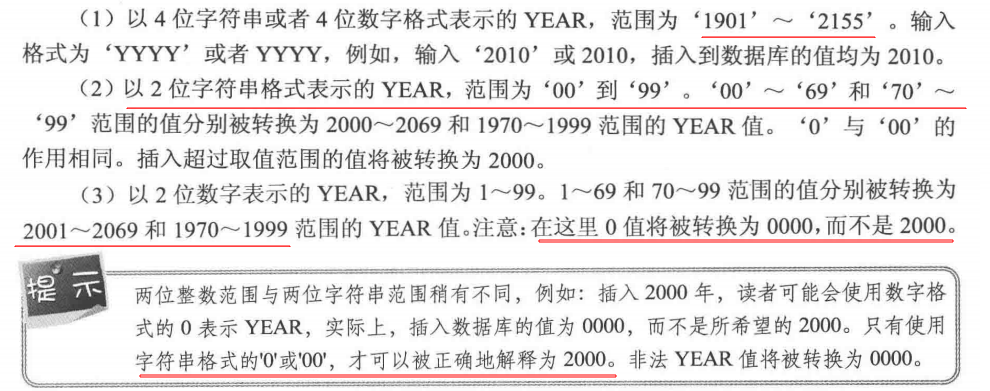

举几个例子:

* **`0`表示`0000`，`‘0’`和`‘00’`表示`2000`；**
* **`‘78’`和`78`表示`1978`，`‘68’`和`68`表示`2068`**；

##### b)、Time

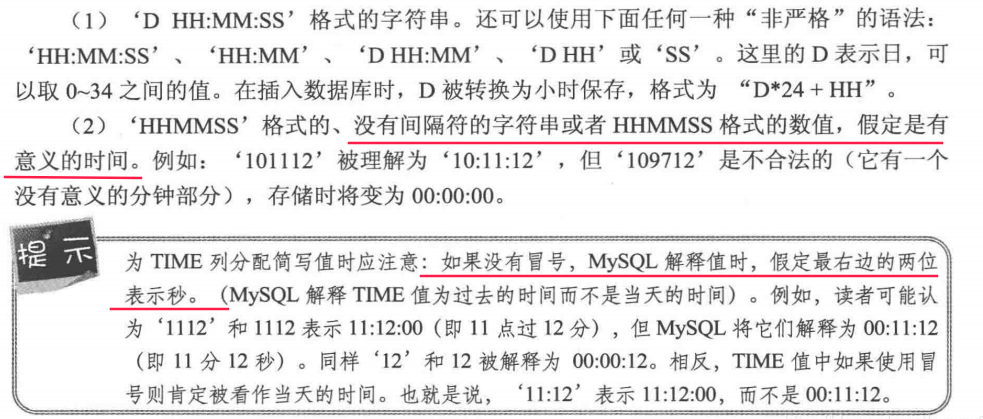

案例:

```mysql
create table tmp4(t Time);
delete from tmp4;
insert into tmp4 values('10:05:05'),('23:23'),('2 10:10'),('3 02'),('10'),(now()),(current_time);
```
效果

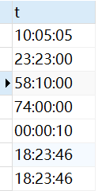

##### c)、Date

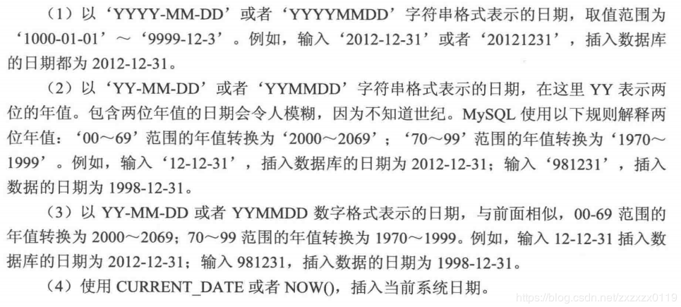

```mysql
create table tmp5(d Date);
insert into tmp5 values('1998-09-01'),('19980902'),('980903'),(19980904),(980905),(100906),(000907),(current_date);
```
效果
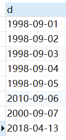
##### d)、DateTime

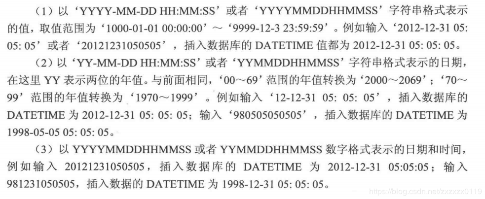

举例:

```sql
create table tmp6(dt DateTime);
insert into tmp6 values('1998-08-08 08:08:08'),('19980809080808'),('98-08-08 08:08:08'),('980808080808'),(19980808080808),(980808080808);
```
效果

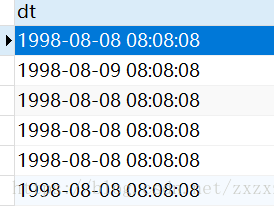

##### e)、TimeStamp
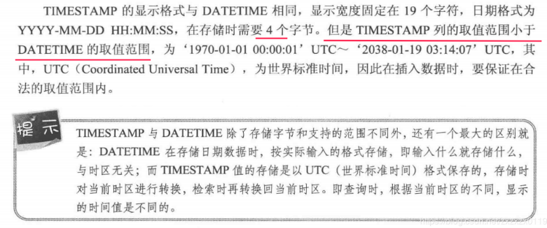

`TimeStamp`把时区修改之后查询结果就会不同，但是`DateTime`不会。

#### 4)、文本字符串类型
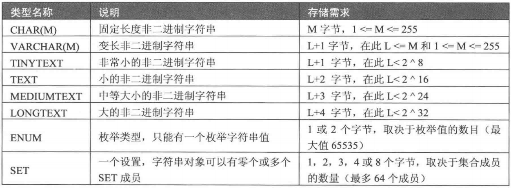

##### a)、`char`和`varchar`类型

`char`数据类型长度不可变，`varchar`长度可变


举例:

```sql
create table tmp8(ch char(4),vch varchar(4));
insert into tmp8 values('ab  ','ab  ');-- 注意这里有空格
select concat('(',ch,')'),concat('(',vch,')') from tmp8;
```
看效果`vch`中的空格没有被截取(即`ch`末尾的两个空格被删除了，而`vch`的没有删除)


##### b)、Text类型

TEXT 列保存**非二进制字符串**，如文章内容、评论等。当保存或查询 TEXT 列的值时，不删除尾部空格。Text 类型分为 4 种: TINYTEXT、TEXT、MEDIUMTEXT 和 LONGTEXT。不同的 TEXT 类型的存储空间和数据长度不同。

* TINYTEXT 最大长度为 255(2<sup>8</sup> - 1)字符的 TEXT 列；

* TEXT 最大长度为 65535(2<sup>16</sup> - 1)字符的TEXT 列；

* MEDIUMTEXT 最大长度为 16777215(2<sup>24</sup> - 1)字符的TEXT列；
* LONGTEXT 最大长度为 4294967295 或 4GB(2<sup>32</sup> - 1)字符的TEXT 列；

##### c)、`Enum`类型

ENUM 是一个字符串对象，其值为表创建时在列规定中枚举的一列值。语法格式如下:''

```mysql
字段名 ENUM('值1', '值2', ..., '值n')
```

字段名指将**要定义的字段**，值n指枚举列表中的第 n 个值。 ENUM 类型的字段在取值时，只能在指定的枚举列表中取，而且一次只能取一个。如果创建的成员中有空格时，其尾部的空格将自动被删除。ENUM 值在内部用整数表示，每个枚举值均有一个索引值: **列表值所允许的成员值从 1 开始编号**，MySQL 存储的就是这个索引编号。枚举最多可以有 65 535 个元素。

例如定义 ENUM 类型的列(first，'second'，'third)，该列可以取的值和每个值的索引如表所示:


举例:

```sql
create table tmp9(enm Enum('first','second','third'));
insert into tmp9 values('first'),('second'),('third'),(null);
select enm,enm+0 from tmp9;
```
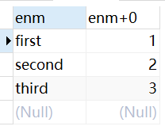
再看一个实例

```sql
create table tmp10(soc int ,level enum('excellent','good','bad'));
insert into tmp10 values(70,'good'),(90,1),(75,2),(50,3); #'excellent','good','bad'-->对应 1，2，3
select soc,level,level+0 from tmp10;
insert into tmp10 values(100,4); #没有4这个选项
```
效果
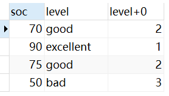

##### d)、Set类型

SET 是一个字符串对象，可以有零或多个值，SET 列最多可以有 64 个成员，其值为表创建时规定的一列值。指定包括多个 SET 成员的 SET 列值时，各成员之间用逗号`(, )`间隔开。语法格式如下:

```mysql
SET('值1', '值2', ... '值n')
```

与 ENUM 类型相同，SET 值在内部用整数表示，**列表中每一个值都有一个索引编号**。当创建表时，SET 成员值的尾部空格将自动被删除。但与 ENUM 类型不同的是，ENUM 类型的字段只能从定义的列值中选择一个值插入，而 SET 类型的列可从定义的列值中选择多个字符的联合。

如果插入 SET 字段中列值有重复，则 **MySQL 自动删除重复的值**，**插入 SET 字段的值的顺序并不重要**，MySQL 会在存入数据库时，按照定义的顺序显示；如果插入了不正确的值，默认情况下，MySQL 将忽视这些值，并给出警告。

```mysql
-- 自动排序去重
create table tmp11(s set('a','b','c','d'));  # 只能插入a,b,c,d这四个值
insert into tmp11 values('a'),('a,b,a'),('c,a,d');
select *from tmp11;
```
效果

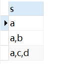

***
#### 5)、二进制字符串类型


##### a)、Bit类型
保存的是数的二进制表示:

BIT 类型是位字段类型。M 表示每个值的位数，范围为 1-64。如果 M 被省略，默认为 1。如果为 BIT(M)列分配的值的长度小于 M 位，在值的左边用 0填充。例如，为 BIT(6)列分配一个值`b'101'`，其效果与分配 `b'000101'`相同。**BIT 数据类型用来保存位字段值**，例如: 以二进制的形式保存数据 13，13 的二进制形式为 1101，在这里需要位数至少为`4`位的 BIT 类型，即可以定义列类型为 BIT(4)。大于二进制 1111 的数据是不能插入 BIT(4)类型的字段中的。

```mysql
#bit
create table tmp12(b bit(4));
insert into tmp12 values(2),(9),(15);
insert into tmp12 values(16);#报错，只能存到0-15
select b,b+0 from tmp12;
```
效果

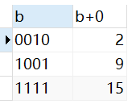


##### b)、Binary和varBinary

BINARY 类型的长度是固定的 指定长度之后 不足最大长度的 将在它们右边填充 `"\0"`补齐以达到指定长度。例如: 指定列数据类型为 BINARY(3)，当插入“a”时，存储的内容实际为`“a\0\0”`，当插入`“ab”`时，实际存储的内容为`“ab\0”`，不管存储的内容是否达到指定的长度，其存储空间均为指定的值 M。

VARBINARY 类型的长度是可变的，指定好长度之后，其长度可以在 0 到最大值之间。例如: 指定列数据类型为 VARBINARY(20)，如果插入的值的长度只有 10，则实际存储空间为 10 加 1，即其实际占用的空间为字符串的实际长度加 1。

```mysql
#binary和varbinary
create table tmp13(b binary(3),vb varbinary(30));
insert into tmp13 values(5,5);
select length(b),length(vb) from tmp13;
```
效果如图:


##### c)、Blob类型

BLOB是一个二进制大对象，用来存储可变数量的数据。有四种类型: TINYBLOB、BLOB、MEDIUMBLOB和LONGBLOB。

**BLOB列存储的是二进制字符串(字节字符串)，TEXT存储的是非二进制字符串(字符字符串)**。

***
### 2、如何选择数据类型

#### 1)、整数和浮点数

如果不需要小数部分，则使用整数来保存数据；

如果需要表示小数部分，则使用浮点数类型。对于浮点数据列，存入的数值会对该列定义的小数位**进行四舍五入**。 例如，如果列的值的范围为 1-99999, 若使用整数，则MEDIUMINT UNSIGNED 是最好的类型，若需要存储小数，则使用 FLOAT 类型。

浮点类型包括 FLOAT 和 DOUBLE 类型。DOUBLE 类型精度比 FLOAT 类型高，因此，如要求存储精度较高时，应选择 DOUBLE 类型。

#### 2)、浮点数和定点数

浮点数FLOAT、DOUBLE 相对于定点数 DECIMAL 的优势是: **在长度一定的情况下, 浮点数能表示更大的数据范围**，但是由于浮点数容易产生误差。

**因此对精确度要求比较高时，建议使用DECIMAL 来存储**。DECIMAL 在 MySQL 中是以**字符串存储**的，用于定义货币等对精确度要求较高的数据。另外**两个浮点数进行减法和比较运算时也容易出问**题，因此在进行计算的时候，一定要小心。如果进行**数值比较，最好使用 DECIMAL 类型**。

#### 3)、日期和时间类型

MySQL 对于不同种类的日期和时间有很多的数据类型，比如 YEAR 和 TIME。如果只需要记录年份，则使用YEAR 类型即可； 如果只记录时间，只需使用TIME 类型。

**如果同时需要记录日期和时间，则可以使用 TIMESTAMP 或者 DATETIME 类型**。由于TIMESTAMP 列的取值范围小于 DATETIME 的取值范围，**因此存储范围较大的日期最好使用DATETIME**。

TIMESTAMP 也有一个DATETIME 不具备的属性。默认的情况下，当插入一条记录但并没有指定 TIMESTAMP 这个列值时，MySQL 会把 TIMESTAMP 列设为当前的时间。**因此当需要插入记录同时插入当前时间**时，使用TIMESTAMP 是方便的，另外 TIMESTAMP 在空间上比 DATETIME 更有效。

#### 4)、char和varchar

char和varchar的区别:

* char是固定长度字符，varchar是可变长度字符；

* CHAR 会自动删除插入数据的尾部空格，VARCHAR 不会删除尾部空格。

CHAR 是固定长度，**所以它的处理速度比 VARCHAR 的速度要快**，但是它的缺点就是浪费存储空间。所以对存储不大，但在速度上有要求的可以使用 CHAR 类型，反之可以使用VARCHAR 类型来实现。

存储引擎对于选择 CHAR 和 VARCHAR 的影响:

* 对于MYyISAM 存储引擎: 最好使用固定长度(`char`)的数据列代替可变长度的数据列。这样可以 **使整个表静态化，从而使数据检索更快，用空间换时间**。
* 对于 InnoDB 存储引擎: 使用可变长度(`varchar`)的数据列，因为 InnoDB 数据表的存储格式不分固定长度和可变长度，因此使用 CHAR 不一定比使用 VARCHAR 更好，但由于VARCHAR 是按照实际的长度存储，比较 **节省空间，所以对磁盘 IO 和数据存储总量比较好**。

#### 5)、ENUM和SET

**ENUM 只能取单值**, 它的数据列表是一个**枚举集合**。它的合法取值列表最多允许有 65 535个成员。因此，在需要从**多个值中选取一个**时，可以使用 ENUM。比如: 性别字段适合定义为 ENUM 类型，每次只能从“男”或“女”中取一个值。

**SET 可取多值**。它的合法取值列表最多允许有 64 个成员。空字符串也是一个合法的 SET值。在需要**取多个值的时候**，适合使用 SET 类型，比如: 要存储一个人兴趣爱好，最好使用SET 类型 。

**ENUM 和 SET 的值是以字符串形式出现的，但在内部，MySQL 以数值的形式存储它们**。

#### 6)、BLOB和TEXT

**BLOB 是二进制字符串，TEXT 是非二进制字符串**，两者均可存放大容量的信息。BLOB主要存储图片、音频信息等，而 TEXT 只能存储纯文本文件。

***
###  3、常见运算符介绍

#### 1)、运算符概述

总共有四大类:

1. 算术运算符

算术运算符用于各类数值运算，包括加 (+) 、减 (-) 、乘 (+) 、除 (/) 、求余(或称模运算，%) 。

2. 比较运算符

比较运算符用于比较运算。包括大于 (>) 、小于 (<) 、等于 (=) 、大于等于 (>=) 、小于等于 (<=) 、不等于 (!=) ，以及`IN、BETWEEN AND、IS NULL、GREATEST、LEAST、LIKE、REGEXP `等。

3. 逻辑运算符

逻辑运算符的求值所得结果均为1 (TRUE) 、0 (FALSE) ，这类运算符有逻辑非 (NOT或者!) 、逻辑与 (AND 或者&&) 、逻辑或 (OR 或者|) 、逻辑异或 C(XOR) 。

4. 位操作运算符

位操作运算符参与运算的操作数按二进制位进行运算。包括位与(&) 、位或 (|) 、位非(~) 、位异或 (^) 、左移 (<<) 、右移 (>>) 6种。

#### 2)、算数运算符

没啥好说的就是`+、－、*、/、%`。

#### 3)、比较运算符

注意一下比较运算符

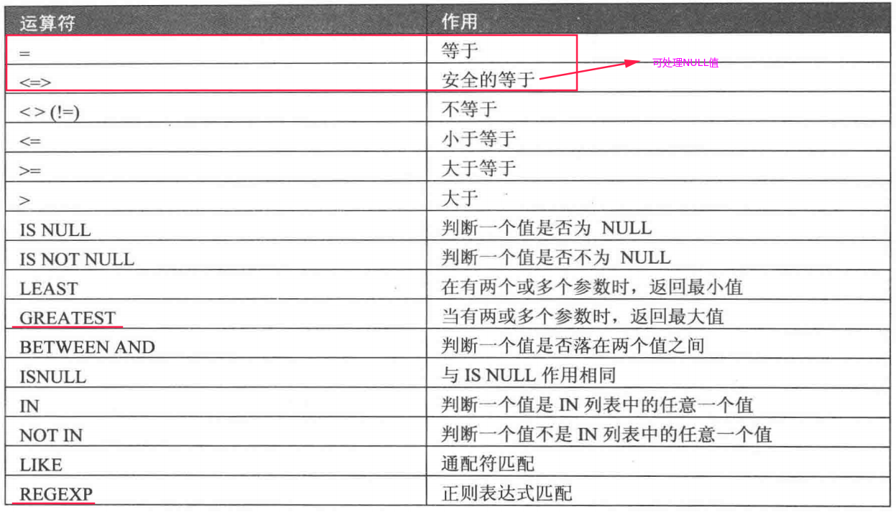

数值比较有如下规则:

* 若有一个或两个参数为NULL，则比较运算的结果为NULL；
* 若同一个比较运算中的两个参数都是字符串，则按照字符串进行比较；
* 若两个参数均为整数，则按照整数进行比较；
* **若一个字符串和数字进行相等判断，则 MySQL 可以自动将字符串转换为数字**；

**安全等于运算符**

这个操作符和=操作符执行相同的比较操作，不过`<=>`可以用来判断 NULL 值。在两个操作数均为NULL 时，其返回值为 1 而不为NULL；而当一个操作数为 NULL 时，其返回值为0而不为NULL。

`<=>`在执行比较操作时和`"="`的作用是相似的，唯一的区别是`<=>`可以来对NULL进行判断，两者都为NULL时返回`1`。

**不等于运算符`<>`或者`!=`**:

`"<>"`或者`"!="`用于判断数字、字符串、表达式不相等的判断。如果不相等，返回值为 1； 否则返回值为 0。这两个运算符不能用于判断空值 NULL。

**LEAST运算符**

语法格式为:

```mysql
LEAST(值 1,值 2…,值m)
```

其中值 `n` 表示参数列表中有`n`个值。在有两个或多个参数的情况下, 返回最小值。假如任意一个自变量为NULL,则`LEAST()`的返回值为`NULL`。

**GREATEST**

语法格式：`GREATEST(值1, 值2, 值3)` ，其中`n`表示参数列表中有`n`个值。当有`2`个或多个参数时，返回为最大值，假如任意一个自变量为NULL，则`GREATEST()`的返回值为NULL。

**LIKE**


**正则表达式REGEXP**

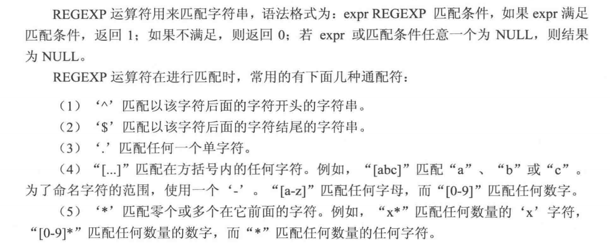

看一个例子

```mysql
select 'ssky' regexp '^s','ssky' regexp 'y$', 'ssky' regexp '.sky', 'ssky' regexp '[ab]';
```
效果

s

* LIKE匹配整个列。如果被匹配的文本在列值 中出现，LIKE将不会找到它，相应的行也不被返回（除非使用 通配符）。

* REGEXP在列值内进行匹配，如果被匹配的文本在 列值中出现，REGEXP将会找到它，相应的行将被返回。

**like有两个模式：`_`和`%`**

`_`：表示单个字符，用来查询定长的数据
```sql
select name from table where name like '陈__';
```
`%`：表示0个或多个任意字符
```sql
select name from table where name like '陈%';
select name from table where name like '%宏%';
```
**regexp可使用正则自由定制**

* 如果要区分大小写，应该使用BINARY关键字
```sql
where xxx REGEXP BINARY 'Hello.000'
```
* 使用|实现or效果
```sql
select * from table where col regexp '1000|2000';
```

* 匹配几个字符之一，用[和]扩起来
```sql
select * from table where col regexp '[abcde]';
```

* 匹配范围：[0-9] [A-Z] [a-z], [^0-9] ^表示非，即匹配不是0-9
后面的比前面大
```sql
select * from table where col regexp '[0-9]Ton';
```

* 匹配特殊字符使用\\进行转义
转义字符 | 含义
:-: | :-:
\\. | 能够匹配.
\\f | 换页
\\n | 换行
\\r | 回车
\\t | 制表
\\ | 纵向制表

**注意**：
1. 为了匹配\本身，需要使用\\\
2. 在一般情况下正则表达式的转义加一个“\”就可以了，在MySQL中需要加两个。


* 匹配字符类（Posix字符类）,使用的时候需要外面加一层[]，例如[[:digit:]]
```sql
select * from table where col regexp 'name[[:digit:]]';
```

* 匹配多个实例
匹配字符 | 含义
:-: | :-:
\* | 0或多个
\+ | 1或多个
? | 0或1个
{n} | 指定n个
{n,} | 不少于n个
{n,m} | n-m个

```sql
select * from table where col regexp '[0-9]{1,3}';
```
* 定位符
匹配字符 | 含义
:-: | :-:
^ | 开始
$ | 结尾
[[:<:]] | 词的开始
[[:>:]] | 词的结尾

^有两个用法，一个是非，一个是文本的开始，用[]中表示非，否则是文本的开始。

* Tips:
1. MySQL的正则比较简化，没有惰性匹配／贪婪匹配，[]内不支持\w\s\d这种语法，也不支持中文。
2. 这两种模式不要混着用，like模式是不支持正则表达式的，REGEXP模式也不认识_和%。
3. 注意：regexp == rlike 同义词  not like  not regexp
4. in不支持模糊查询，如：
```sql
select * from table where name in ('%宏%');
```
5. like concat('%',name,'%')作用在于name为变量，在传参的时候方便。


#### 4)、逻辑运算符

和高级语言差不多，不赘述。

#### 5)、位运算

和高级语言差不多，不赘述。

#### 6)、运算符优先级

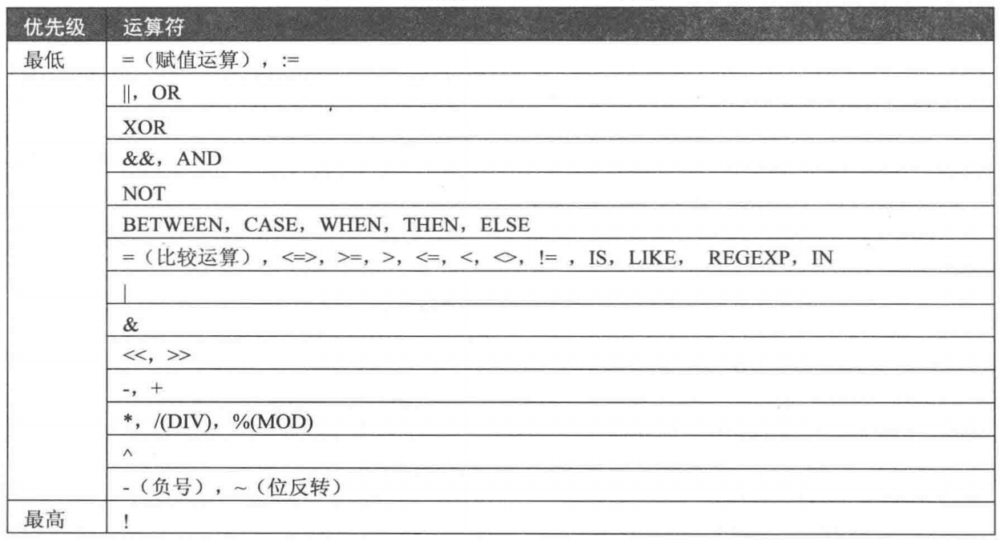

### 4、综合案例-运算符的使用

```mysql
create table tmp15(note varchar(100),price int);
insert into tmp15 values("Thisisgood",50);
#算术运算符
select price,price+10,price-10,price*2,price/2,price%3 from tmp15;
#比较运算符
select price,price>10,price<10,price != 10,price = 10,price <=>10,price <>10 from tmp15;
# in, greatest等
select price,price between 30 and 80,greatest(price,70,30),price in(10,20,50,35) from tmp15;
# 正则等
select note,note is null,note like 't%',note regexp '$y',note regexp '[gm]' from tmp15;
# 逻辑运算
select price,price&2,price|4, ~price from tmp15;
# 位运算
select price,price<<2,price>>2 from tmp15;
```

***
## 四、Mysql函数

### 1、数学函数

#### 1)、绝对值，π，平方根，去余函数(适用小数)

```mysql
#绝对值，π，平方根，去余函数(适用小数)
mysql> select abs(-1),pi(),sqrt(9),Mod(31,8),Mod(45.5,6);

效果:

+---------+----------+---------+-----------+-------------+
| abs(-1) | pi()     | sqrt(9) | Mod(31,8) | Mod(45.5,6) |
+---------+----------+---------+-----------+-------------+
|       1 | 3.141593 |       3 |         7 |         3.5 |
+---------+----------+---------+-----------+-------------+

```
#### 2)、获取整数的函数

```mysql
#获取整数的函数
mysql> select ceil(-3.5),ceiling(3.5),floor(-3.5),floor(3.5);

效果:

+------------+--------------+-------------+------------+
| ceil(-3.5) | ceiling(3.5) | floor(-3.5) | floor(3.5) |
+------------+--------------+-------------+------------+
|         -3 |            4 |          -4 |          3 |
+------------+--------------+-------------+------------+

```
#### 3)、获取随机数的函数

```mysql
#获取随机数的函数
mysql> select rand(),rand(),rand(10),rand(10);

效果:

+--------------------+---------------------+--------------------+--------------------+
| rand()             | rand()              | rand(10)           | rand(10)           |
+--------------------+---------------------+--------------------+--------------------+
| 0.9031498375378082 | 0.46329259729319494 | 0.6570515219653505 | 0.6570515219653505 |
+--------------------+---------------------+--------------------+--------------------+

可以看到前面两个不同，后面两个指定了种子所以相同。
```
#### 4)、Round函数(四舍五入函数)，truncate()函数

```mysql
#Round函数(四舍五入函数)，truncate()函数
mysql> select round(3.4),(3.6),round(3.16,1),round(3.16,0),round(232.28,-1),truncate(1.31,1),truncate(1.99,1),truncate(19.99,-1);

效果:

+------------+-----+---------------+---------------+------------------+------------------+------------------+--------------------+
| round(3.4) | 3.6 | round(3.16,1) | round(3.16,0) | round(232.28,-1) | truncate(1.31,1) | truncate(1.99,1) | truncate(19.99,-1) |
+------------+-----+---------------+---------------+------------------+------------------+------------------+--------------------+
|          3 | 3.6 |           3.2 |             3 |              230 |              1.3 |              1.9 |                 10 |
+------------+-----+---------------+---------------+------------------+------------------+------------------+--------------------+

```
#### 5)、符号函数，幂运算函数pow,power,exp()

```mysql
#符号函数，幂运算函数pow,power,exp()//e的x乘方
mysql> select sign(-21),sign(0),sign(21),pow(2,2),power(2,-2),exp(2);

效果:

+-----------+---------+----------+----------+-------------+------------------+
| sign(-21) | sign(0) | sign(21) | pow(2,2) | power(2,-2) | exp(2)           |
+-----------+---------+----------+----------+-------------+------------------+
|        -1 |       0 |        1 |        4 |        0.25 | 7.38905609893065 |
+-----------+---------+----------+----------+-------------+------------------+

```
#### 6)、自然对数运算和以10为底的对数运算，弧度，角度 radians角度转弧度，弧度转角度

```mysql
#自然对数运算和以10为底的对数运算,弧度，角度 radians角度转弧度，弧度转角度
mysql> select log(3),log(-3),log10(100),log10(-100),radians(180),degrees(pi()/2);

效果:

+--------------------+---------+------------+-------------+-------------------+-----------------+
| log(3)             | log(-3) | log10(100) | log10(-100) | radians(180)      | degrees(pi()/2) |
+--------------------+---------+------------+-------------+-------------------+-----------------+
| 1.0986122886681098 |    NULL |          2 |        NULL | 3.141592653589793 |              90 |
+--------------------+---------+------------+-------------+-------------------+-----------------+

```
#### 7)、正弦函数余弦函数

```mysql
#正弦函数余弦函数
mysql> select sin(pi()/2),degrees(asin(1)),cos(pi()),degrees(acos(-1)),round(tan(pi()/4)),degrees(atan(1)),cot(pi()/4);

效果:

+-------------+------------------+-----------+-------------------+--------------------+------------------+--------------------+
| sin(pi()/2) | degrees(asin(1)) | cos(pi()) | degrees(acos(-1)) | round(tan(pi()/4)) | degrees(atan(1)) | cot(pi()/4)        |
+-------------+------------------+-----------+-------------------+--------------------+------------------+--------------------+
|           1 |               90 |        -1 |               180 |                  1 |               45 | 1.0000000000000002 |
+-------------+------------------+-----------+-------------------+--------------------+------------------+--------------------+

```
### 2、字符串函数

#### 1)、字符串函数、concat_ws忽略空值null

```mysql
#字符串函数,concat_ws忽略空值null
mysql> select char_length('aab'),length('aabb'),concat('My sql ','5.7'),concat('My',null,'sql'),concat_ws('-','a','b','c'),concat_ws('*','aa',null,'bb');

效果:

+--------------------+----------------+-------------------------+-------------------------+----------------------------+-------------------------------+
| char_length('aab') | length('aabb') | concat('My sql ','5.7') | concat('My',null,'sql') | concat_ws('-','a','b','c') | concat_ws('*','aa',null,'bb') |
+--------------------+----------------+-------------------------+-------------------------+----------------------------+-------------------------------+
|                  3 |              4 | My sql 5.7              | NULL                    | a-b-c                      | aa*bb                         |
+--------------------+----------------+-------------------------+-------------------------+----------------------------+-------------------------------+

```
#### 2)、替换字符串的函数

```mysql
#替换字符串的函数
mysql> select insert('Quest',2,4,'What') as Coll,insert('Quest',-1,4,'What') as Coll2,insert('Quest',3,100,'Wh') as Coll3;

效果:

+-------+-------+-------+
| Coll  | Coll2 | Coll3 |
+-------+-------+-------+
| QWhat | Quest | QuWh  |
+-------+-------+-------+

```
#### 3)、大小写转换、获取指定长度字符串的函数left,right

```mysql
#大小写转换,获取指定长度字符串的函数left,right;
mysql> select lower('ZHENGXIN'),lcase('ZHENGXIN'),upper('zhengxin'),ucase('zhengxin'),left('football',5),right('football',5);

效果:

+-------------------+-------------------+-------------------+-------------------+--------------------+---------------------+
| lower('ZHENGXIN') | lcase('ZHENGXIN') | upper('zhengxin') | ucase('zhengxin') | left('football',5) | right('football',5) |
+-------------------+-------------------+-------------------+-------------------+--------------------+---------------------+
| zhengxin          | zhengxin          | ZHENGXIN          | ZHENGXIN          | footb              | tball               |
+-------------------+-------------------+-------------------+-------------------+--------------------+---------------------+

```
#### 4)、填充字符串的函数,删除空格的函数

```mysql
#填充字符串的函数,删除空格的函数
mysql> select lpad('hello',4,'*'),lpad('hello',10,'*'),
    -> rpad('hello',10,'*'),concat('(',ltrim('   book   '),')'),
    -> concat('(',rtrim('   book   '),')'),
    -> concat('(',trim('   book   '),')'),
    -> trim('xy' from 'xyxyabababxyxy');

效果:

+---------------------+----------------------+----------------------+-------------------------------------+-------------------------------------+------------------------------------+----------------------------------+
| lpad('hello',4,'*') | lpad('hello',10,'*') | rpad('hello',10,'*') | concat('(',ltrim('   book   '),')') | concat('(',rtrim('   book   '),')') | concat('(',trim('   book   '),')') | trim('xy' from 'xyxyabababxyxy') |
+---------------------+----------------------+----------------------+-------------------------------------+-------------------------------------+------------------------------------+----------------------------------+
| hell                | *****hello           | hello*****           | (book   )                           | (   book)                           | (book)                             | ababab                           |
+---------------------+----------------------+----------------------+-------------------------------------+-------------------------------------+------------------------------------+----------------------------------+

```
#### 5)、重复生成,空格函数，替换函数，比较大小的函数

```mysql
#重复生成,空格函数，替换函数，比较大小的函数
mysql> select repeat('mysql',3),concat('(',space(6),')'),
    -> replace('xxx.baidu.com','x','w'),strcmp('abc','abd');

效果:

+-------------------+--------------------------+----------------------------------+---------------------+
| repeat('mysql',3) | concat('(',space(6),')') | replace('xxx.baidu.com','x','w') | strcmp('abc','abd') |
+-------------------+--------------------------+----------------------------------+---------------------+
| mysqlmysqlmysql   | (      )                 | www.baidu.com                    |                  -1 |
+-------------------+--------------------------+----------------------------------+---------------------+

```
#### 6)、获取子串的函数

```mysql
#获取子串的函数
mysql> select substring('breakfast',5) as coll,
    -> substring('breakfast',3,5) as coll2,
    -> substring('breakfast',-3) as coll3, #从后面开始截取3个
    -> substring('breakfast',-1,4) as coll4; #从结尾开始第一个位置截取四个

效果:

+-------+-------+-------+-------+
| coll  | coll2 | coll3 | coll4 |
+-------+-------+-------+-------+
| kfast | eakfa | ast   | t     |
+-------+-------+-------+-------+

```
<font color = crimson>注意还有一个MID函数和substring作用是一样的</font>

```mysql
#匹配字串开始的位置,字符串逆序
mysql> select locate('ball','football'),position('ball'in'football'),
    -> instr('football','ball'),reverse('abc');

效果:

+---------------------------+------------------------------+--------------------------+----------------+
| locate('ball','football') | position('ball'in'football') | instr('football','ball') | reverse('abc') |
+---------------------------+------------------------------+--------------------------+----------------+
|                         5 |                            5 |                        5 | cba            |
+---------------------------+------------------------------+--------------------------+----------------+

```
#### 7)、返回指定位置的值，返回指定字符串的位置的函数

```mysql
#返回指定位置的值,返回指定字符串的位置的函数
mysql> select elt(3,'a','b','c'),elt(2,'a'),
    -> field('Hi','hihi','Hey','Hi','bas') as coll,
    -> field('Hi','hihi','a','b') as coll2,
    -> find_in_set('Hi','hihi,Hey,Hi,bas'); #返回字串位置的函数

效果:

+--------------------+------------+------+-------+-------------------------------------+
| elt(3,'a','b','c') | elt(2,'a') | coll | coll2 | find_in_set('Hi','hihi,Hey,Hi,bas') |
+--------------------+------------+------+-------+-------------------------------------+
| c                  | NULL       |    3 |     0 |                                   3 |
+--------------------+------------+------+-------+-------------------------------------+

```
#### 8)、make_set()函数的使用

```mysql
#make_set()函数的使用
mysql> select make_set(1,'a','b','c') as coll,#0001选第一个
    -> make_set(1|4, 'hello','nice','word') as coll2, #0001 0100-->0101 -->选第一和第三
    -> make_set(1|4,'hello','nice',null,'word') as coll3,#0001 0100-->0101 -->选第一和第三
    -> make_set(0,'a','b','c') as coll4;

效果:

+------+------------+-------+-------+
| coll | coll2      | coll3 | coll4 |
+------+------------+-------+-------+
| a    | hello,word | hello |       |
+------+------------+-------+-------+

```
***
### 3、日期和时间函数

#### 1)、获取日期时间函数

```mysql
#获取日期时间函数
mysql> select current_date(),curdate(),curdate()+0,
    -> current_time(),curtime(),curtime()+0,
    -> current_timestamp(),localtime(),now(),sysdate();

效果:

+----------------+------------+-------------+----------------+-----------+-------------+---------------------+---------------------+---------------------+---------------------+
| current_date() | curdate()  | curdate()+0 | current_time() | curtime() | curtime()+0 | current_timestamp() | localtime()         | now()               | sysdate()           |
+----------------+------------+-------------+----------------+-----------+-------------+---------------------+---------------------+---------------------+---------------------+
| 2019-02-25     | 2019-02-25 |    20190225 | 10:40:22       | 10:40:22  |      104022 | 2019-02-25 10:40:22 | 2019-02-25 10:40:22 | 2019-02-25 10:40:22 | 2019-02-25 10:40:22 |
+----------------+------------+-------------+----------------+-----------+-------------+---------------------+---------------------+---------------------+---------------------+s
```
#### 2)、获取时间的数字，根据时间获取日期(互为反函数)

```mysql
#获取时间的数字,根据时间获取日期(互为反函数)
mysql> select unix_timestamp(),unix_timestamp(now()),now(),
    -> from_unixtime(1523689758);

效果:

+------------------+-----------------------+---------------------+---------------------------+
| unix_timestamp() | unix_timestamp(now()) | now()               | from_unixtime(1523689758) |
+------------------+-----------------------+---------------------+---------------------------+
|       1551062468 |            1551062468 | 2019-02-25 10:41:08 | 2018-04-14 15:09:18       |
+------------------+-----------------------+---------------------+---------------------------+

```
#### 3)、返回当前时区日期和时间的函数，日期月份时间函数

```mysql
#返回当前时区日期和时间的函数,日期月份时间函数
mysql> select utc_time(),utc_time()+0,
    -> utc_date(),utc_date()+0,
    -> month('2016-03-04'),monthname('2016-03-04'),
    -> dayname('2018-04-14'),dayofweek('2018-04-14'),
    -> weekday('2018-04-14');

效果:

+------------+--------------+------------+--------------+---------------------+-------------------------+-----------------------+-------------------------+-----------------------+
| utc_time() | utc_time()+0 | utc_date() | utc_date()+0 | month('2016-03-04') | monthname('2016-03-04') | dayname('2018-04-14') | dayofweek('2018-04-14') | weekday('2018-04-14') |
+------------+--------------+------------+--------------+---------------------+-------------------------+-----------------------+-------------------------+-----------------------+
| 02:41:56   |        24156 | 2019-02-25 |     20190225 |                   3 | March                   | Saturday              |                       7 |                     5 |
+------------+--------------+------------+--------------+---------------------+-------------------------+-----------------------+-------------------------+-----------------------+

```
注意dayofweek和weekday的差别：

* `DAYOFWEEK(d)`函数返回d对应的一周中的索引(位置)。1表示周日，2表示周一，....，7表示周六；
* `WEEKDAY(d)`返回d对应的工作日索引。0表示周一，1表示周二，...，6表示周日；

```mysql
#返回是这一年的第几周
mysql> select week('2018-4-16'),#默认0表示第一天从周末开始
    -> week('2018-04-16',1), #周一#返回是这一年的第几周
    -> dayofyear('2018-4-16'),dayofmonth('2018-4-14'), #返回一年中的第几天
    -> year('2018-4-14'),quarter('2018-4-14'),
    -> minute('10:10:02'),second("10:10:02");

效果:

+-------------------+----------------------+------------------------+-------------------------+-------------------+----------------------+--------------------+--------------------+
| week('2018-4-16') | week('2018-04-16',1) | dayofyear('2018-4-16') | dayofmonth('2018-4-14') | year('2018-4-14') | quarter('2018-4-14') | minute('10:10:02') | second("10:10:02") |
+-------------------+----------------------+------------------------+-------------------------+-------------------+----------------------+--------------------+--------------------+
|                15 |                   16 |                    106 |                      14 |              2018 |                    2 |                 10 |                  2 |
+-------------------+----------------------+------------------------+-------------------------+-------------------+----------------------+--------------------+--------------------+

```
#### 4)、获取指定日期的指定值的函数

```mysql
#获取指定日期的指定值的函数
mysql> select extract(year from '2018-07-06') as coll,
    -> extract(year_month from '2018-08-06') as coll2,
    -> extract(day_minute from '2018-07-06 10:11:05') as coll3;

效果:

+------+--------+-------+
| coll | coll2  | coll3 |
+------+--------+-------+
| 2018 | 201808 | 61011 |
+------+--------+-------+

```
#### 5)、时间和秒钟转换的函数

```mysql
#时间和秒钟转换的函数
mysql> select time_to_sec('01:00:40'),
    -> sec_to_time(3600);

效果:    

+-------------------------+-------------------+
| time_to_sec('01:00:40') | sec_to_time(3600) |
+-------------------------+-------------------+
|                    3640 | 01:00:00          |
+-------------------------+-------------------+

```
#### 6)、计算日期和时间的函数

```mysql
#计算日期和时间的函数
mysql> select date_add('2010-12-31 23:59:59',interval 1 second) as coll,
    -> adddate('2010-12-31 23:59:59',interval 1 second) as coll2,
    -> date_add('2010-12-31 23:59:59',interval '0:0:1' hour_second) as coll3, #后面的hour_second要看表决定
    -> date_sub('2011-01-02',interval 31 day) as coll4,
    -> subdate('2011-01-02',interval 31 day) as coll5,
    -> date_sub('2011-01-02 00:01:00',interval '0 0:1:1' day_second) as coll6; #对应位置的相减

效果:

+---------------------+---------------------+---------------------+------------+------------+---------------------+
| coll                | coll2               | coll3               | coll4      | coll5      | coll6               |
+---------------------+---------------------+---------------------+------------+------------+---------------------+
| 2011-01-01 00:00:00 | 2011-01-01 00:00:00 | 2011-01-01 00:00:00 | 2010-12-02 | 2010-12-02 | 2011-01-01 23:59:59 |
+---------------------+---------------------+---------------------+------------+------------+---------------------+

```
#### 7)、直接输入两个时间，计算

```mysql
#直接输入两个时间，计算
mysql> select addtime('2000-12-31 23:59:59','1:1:1') as coll,
    -> subtime('2000-12-31 23:59:59','1:1:1')as coll2,
    -> datediff('2000-12-28','2001-01-03') as coll3; #前面的减后面的
+---------------------+---------------------+-------+
| coll                | coll2               | coll3 |
+---------------------+---------------------+-------+
| 2001-01-01 01:01:00 | 2000-12-31 22:58:58 |    -6 |
+---------------------+---------------------+-------+

```
注意日期的一些区别:


日期和时间格式化的函数


#### 8)、时间日期格式化函数

```mysql
#时间日期格式化函数
mysql> select date_format('1997-10-04 22:23:00','%W %M %Y') as coll,
    -> date_format('1997-10-04 22:23:00','%D %y %a %d %m %b %j'),
    -> time_format('16:00:00','%H %k %h %I %l'),
    -> date_format('2000-10-05 22:23:00',get_format(date,'USA'));

效果:

+-----------------------+-----------------------------------------------------------+------------------------------------------+-----------------------------------------------------------+
| coll                  | date_format('1997-10-04 22:23:00','%D %y %a %d %m %b %j') | time_format('16:00:00','%H %k %h %I %l') | date_format('2000-10-05 22:23:00',get_format(date,'USA')) |
+-----------------------+-----------------------------------------------------------+------------------------------------------+-----------------------------------------------------------+
| Saturday October 1997 | 4th 97 Sat 04 10 Oct 277                                  | 16 16 04 04 4                            | 10.05.2000                                                |
+-----------------------+-----------------------------------------------------------+------------------------------------------+-----------------------------------------------------------+

```
### 4、条件判断函数

```mysql
#条件约束函数
mysql> select if(1>2,2,3),
    -> ifNull(null,10),ifNull(1/0,100),
    -> case 2 when 1 then 'one' when 2 then 'two' when 3 then 'three' else 'more' end, #2等于后面的2返回后面的then
    -> case when 1>2 then 'a' else 'b' end;

效果:

+-------------+-----------------+-----------------+--------------------------------------------------------------------------------+-------------------------------------+
| if(1>2,2,3) | ifNull(null,10) | ifNull(1/0,100) | case 2 when 1 then 'one' when 2 then 'two' when 3 then 'three' else 'more' end | case when 1>2 then 'a' else 'b' end |
+-------------+-----------------+-----------------+--------------------------------------------------------------------------------+-------------------------------------+
|           3 |              10 |        100.0000 | two                                                                            | b                                   |
+-------------+-----------------+-----------------+--------------------------------------------------------------------------------+-------------------------------------+

```
### 5、系统信息函数

```mysql
#系统信息函数
mysql> show processlist;#输出当前用户的连接信息

效果:

+----+------+-----------+------------+---------+------+----------+------------------+
| Id | User | Host      | db         | Command | Time | State    | Info             |
+----+------+-----------+------------+---------+------+----------+------------------+
|  2 | root | localhost | learnmysql | Query   |    0 | starting | show processlist |
+----+------+-----------+------------+---------+------+----------+------------------+
1 row in set (0.00 sec)

```
```mysql
#获取字符串的字符集和排列方式的函数
mysql> select charset('abc'),charset(convert('abc' using latin1)),
    -> charset(version()), #获取字符集
    -> collation('abc'),collation(convert('abc' using utf8));#获取排列方式

效果:    

+----------------+--------------------------------------+--------------------+------------------+--------------------------------------+
| charset('abc') | charset(convert('abc' using latin1)) | charset(version()) | collation('abc') | collation(convert('abc' using utf8)) |
+----------------+--------------------------------------+--------------------+------------------+--------------------------------------+
| utf8           | latin1                               | utf8               | utf8_general_ci  | utf8_general_ci                      |
+----------------+--------------------------------------+--------------------+------------------+--------------------------------------+

```
还要注意Last_insert_id最后自动生成的ID值。

### 6、加/解密函数

```mysql
mysql> select password('newpwd'),MD5('mypwd'),
    -> encode('secret','cry'),length(encode('secret','cry')),
    -> decode(encode('secret','cry'),'cry');#加密后解密

效果:

+-------------------------------------------+----------------------------------+------------------------+--------------------------------+--------------------------------------+
| password('newpwd')                        | MD5('mypwd')                     | encode('secret','cry') | length(encode('secret','cry')) | decode(encode('secret','cry'),'cry') |
+-------------------------------------------+----------------------------------+------------------------+--------------------------------+--------------------------------------+
| *1FA85AA204CC12B39B20E8F1E839D11B3F9E6AA4 | 318bcb4be908d0da6448a0db76908d78 | �h��                     |                              6 | secret                               |
+-------------------------------------------+----------------------------------+------------------------+--------------------------------+--------------------------------------+

```
### 7、其他函数

```mysql
mysql> select format(123.1234,2),format(123.1,3),format(123.123,0),#格式化函数
    -> #不同进制数之间的转换
    -> conv('a',16,2),conv(15,10,2),conv(15,10,8),conv(15,10,16);

效果:   

+--------------------+-----------------+-------------------+----------------+---------------+---------------+----------------+
| format(123.1234,2) | format(123.1,3) | format(123.123,0) | conv('a',16,2) | conv(15,10,2) | conv(15,10,8) | conv(15,10,16) |
+--------------------+-----------------+-------------------+----------------+---------------+---------------+----------------+
| 123.12             | 123.100         | 123               | 1010           | 1111          | 17            | F              |
+--------------------+-----------------+-------------------+----------------+---------------+---------------+----------------+

```

```mysql
#IP地址与数字相互转换的函数
mysql> select inet_aton('209.207.224.40'),inet_ntoa(3520061480),
    -> #枷锁函数和解锁函数
    -> get_lock('lock1',10),#这个锁持续10秒
    -> is_used_lock('lock1'),  #返回当前连接ID
    -> is_free_lock('lock1'), #是否是可用的
    -> release_lock('lock1');

效果:

+-----------------------------+-----------------------+----------------------+-----------------------+-----------------------+-----------------------+
| inet_aton('209.207.224.40') | inet_ntoa(3520061480) | get_lock('lock1',10) | is_used_lock('lock1') | is_free_lock('lock1') | release_lock('lock1') |
+-----------------------------+-----------------------+----------------------+-----------------------+-----------------------+-----------------------+
|                  3520061480 | 209.207.224.40        |                    1 |                     2 |                     0 |                     1 |
+-----------------------------+-----------------------+----------------------+-----------------------+-----------------------+-----------------------+

```
```mysql
#重复执行指定操作的函数
mysql> select benchmark(5000,password('newpad')),
    -> charset('abc'),charset(convert('abc' using latin1)),#改变字符集的函数
    -> cast(100 as char(2)),convert('2010-10-11 12:12:12',time);#改变数据类型的函数

效果:

+------------------------------------+----------------+--------------------------------------+----------------------+-------------------------------------+
| benchmark(5000,password('newpad')) | charset('abc') | charset(convert('abc' using latin1)) | cast(100 as char(2)) | convert('2010-10-11 12:12:12',time) |
+------------------------------------+----------------+--------------------------------------+----------------------+-------------------------------------+
|                                  0 | utf8           | latin1                               | 10                   | 12:12:12                            |
+------------------------------------+----------------+--------------------------------------+----------------------+-------------------------------------+

```
### 8、综合案列-Mysql函数的使用

```mysql
select round(rand() * 10),round(rand() * 10),round(rand() * 10);#产生三个1-10之间的随机数
select pi(),sin(pi()),cos(0),round(tan(pi()/4)),floor(cot(pi()/4));

create database test_db3;
use test_db3;
show tables;
create table member
(
	m_id int(11) primary key auto_increment,
	m_FN varchar(15),
	m_LN varchar(15),
	m_brith datetime,
	m_info varchar(15) null
);

insert into member values(null,'Halen','Park','1970-06-29','GoodMan');

select length(m_FN),#返回m_FN的长度
concat(m_FN,m_LN),#返回第一条记录中的全名
lower(m_info),#将m_info转换成小写
reverse(m_info) from member;

select year(curdate())-year(m_brith) as age,#计算年龄
dayofyear(m_brith) as days,
date_format(m_brith,'%W %D %M %Y') as birthDate from member;

insert into member values(null,'Samuel','Green',now(),null);

select last_insert_id(); #输出最后插入的自增的编号

select m_brith,case when year(m_brith) < 2000 then 'old'
when year(m_brith) > 2000 then 'young'
else 'not born' end as status from member;
```
