# Redis主从复制

* [一、概念和作用](一概念和作用)
* [二、复制原理](#二复制原理)
* [三、修改配置文件细节操作](#三修改配置文件细节操作)
* [四、常见三种配置用法](#四常见三种配置用法)
  * [1、一主二仆](#1一主二仆)
  * [2、薪火相传](#2薪火相传)
  * [3、反客为主](#3反客为主)
  * [4、哨兵模式](#4哨兵模式)

## 一、概念和作用

概念：主机数据更新后根据配置和策略， 自动同步到备机的`master/slaver`机制，**Master以写为主，Slave以读为主**。

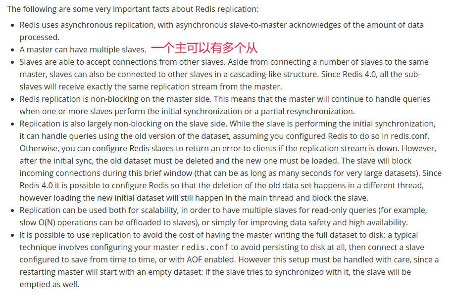

作用:

* 读写分离；
* 容灾恢复；

## 二、复制原理

* `slave`启动成功连接到`master`后会发送一个`sync`命令；
* Master接到命令启动后台的存盘进程，同时收集所有接收到的用于修改数据集命令， **在后台进程执行完毕之后，master将传送整个数据文件到slave**，以完成一次完全同步；
* 全量复制：而`slave`服务在接收到数据库文件数据后，将其存盘并加载到内存中；
* 增量复制：Master继续将新的所有收集到的修改命令依次传给slave，完成同步；
* 但是只要是重新连接master,**一次完全同步（全量复制）将被自动执行**；

下面结合实战和理论解释。

> 缺点: 由于所有的写操作都是先在Master上操作，然后同步更新到Slave上，所以从Master同步到Slave机器有一定的延迟，当系统很繁忙的时候，延迟问题会更加严重，Slave机器数量的增加也会使这个问题更加严重。。

## 三、修改配置文件细节操作

配置原则:

* 配从(库)不配主(库)；
* 从库配置：`slaveof 主库IP 主库端口`
  * **每次与master断开之后，都需要重新连接，除非你配置进`redis.conf`文件**；(下面有个例子，从机`down`了之后，再回来就没有了，需要重新`SLAVEOF`连接。)
  * 使用`info replication`查看当前库的信息(是从库还是主库。以及其他信息)；
* 修改配置文件细节操作。
  * 拷贝多个`redis.conf`文件，也就是每个库(在不同机器)有一个`redis.conf`；
  * 开启`daemonize yes`；
  * pid文件名字；
  * 指定端口；
  * log文件名字；
  * `dump.rdb`名字；

实操配置:

①编写三个配置文件：

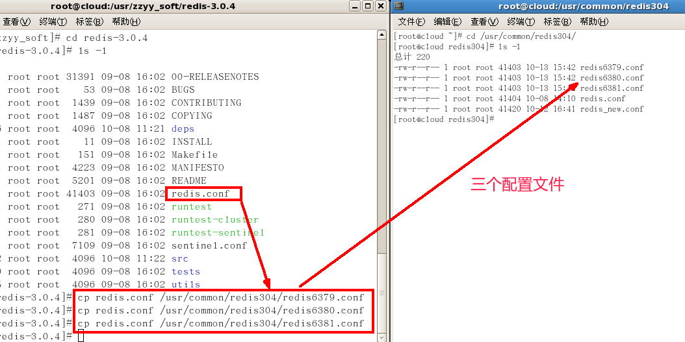

②修改配置

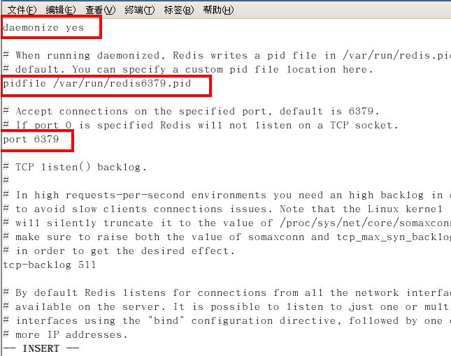

③修改LOG等

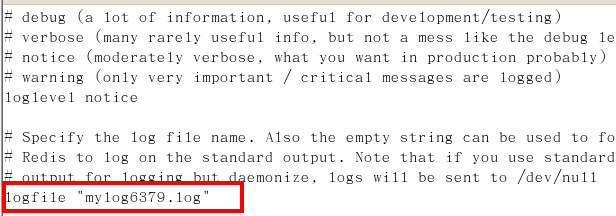

## 四、常见三种配置用法

搭建三台客户端。一开始都是主库:
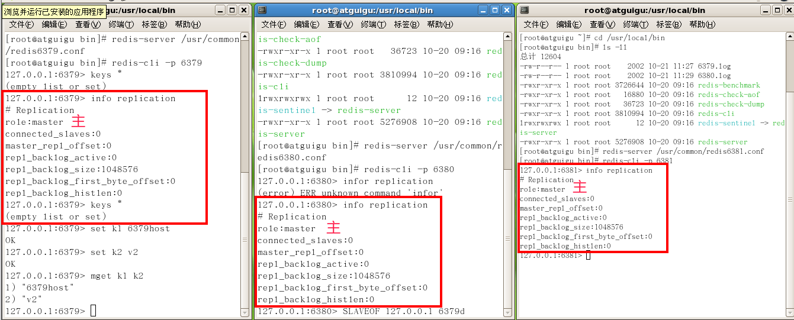

### 1、一主二仆

也就是: 一个Master两个Slave。

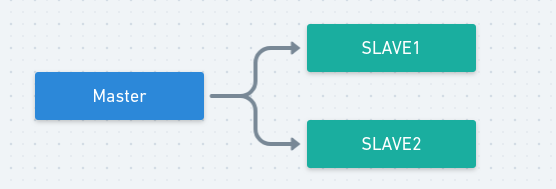
 

相关演示:

可以查看主机的日志，此时发现有两个`slave`挂在主机下面:

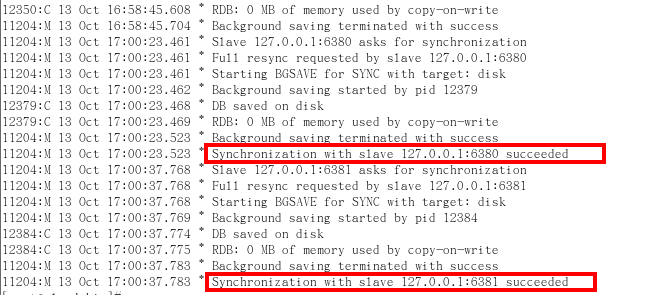
 

以及备机的日志:

用`info replicatino`查看:

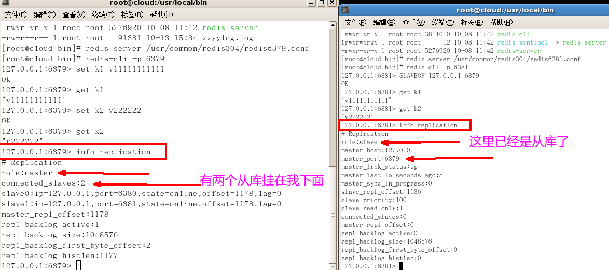

相关问题:

（１）切入点问题？slave1、slave2是从头开始复制还是从切入点开始复制? 比如从k4进来，那之前的123是否也可以复制？

答: 可以。

（2 ）从机是否可以写？set可否？

答: 不可以，主要是读。

（3 ）主机shutdown后情况如何？从机是上位还是原地待命

答: 从机待命。还是`slave`。

（4 ）主机又回来了后，主机新增记录，从机还能否顺利复制？

答： 可以，老领导回来了，我继续跟着你。

（5） 其中一台从机down后情况如何？依照原有它能跟上大部队吗？

答: **不可以**。需要重新`SLAVEOF`连接。上面也说过了

**每次与master断开之后，都需要重新连接，除非你配置进`redis.conf`文件**；(从机`down`了之后，再回来就没有了，需要重新`SLAVEOF`连接。)

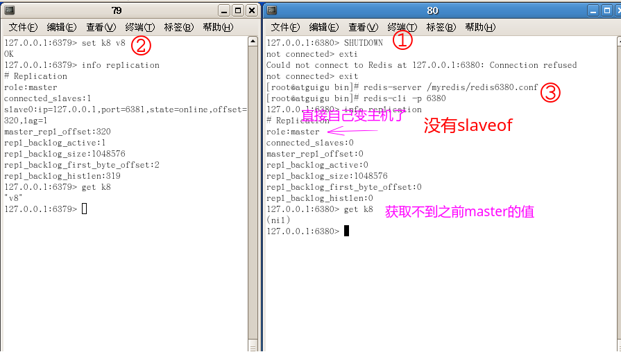

### 2、薪火相传

上一个Slave可以是下一个slave的Master，Slave同样可以接收其他 slaves的连接和同步请求，那么该slave作为了链条中下一个的master, **可以有效减轻master的写压力**。

如果中途变更转向:**会清除之前的数据，重新建立拷贝最新的**。

命令: `slaveof 新主库IP 新主库端口`。

演示:

`6379`作为`Master`，`6380`连接到`6379`，然后`6381`连接到`6380`。（注意此时`6380`也是`slave`）

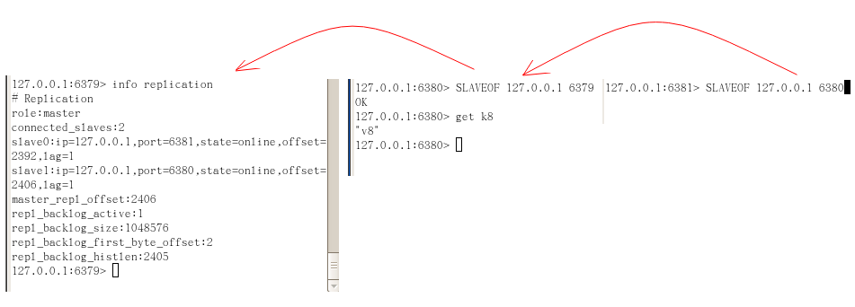

### 3、反客为主

在一个`Master`两个`slave`的情况下，如果主机挂了，从库需要手动调用`SLAVEOF no one`命令，来使当前数据库停止与其他数据库的同步，转成主数据库。

演示:

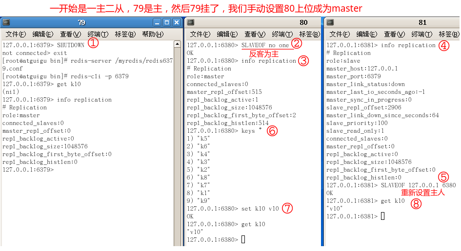

### 4、哨兵模式

配置

* 调整结构，6379带着80、81。
* 自定义的`/myredis`目录下新建`sentinel.conf`文件，名字绝不能错。
* 配置哨兵，填写内容:
  * `sentinel monitor 被监控数据库名字(自己起名字) 127.0.0.1 6379 1`。
  * 上面最后一个数字1，表示主机挂掉后salve投票看让谁接替成为主机，得票数多少后成为主机；
  * 例如配置: `sentinel monitor host6379 127.0.0.1 6379 1`。如果`6379`挂了，谁的票数多余1票，就自动化成为主机；
* 启动哨兵:
  * `redis-sentinel /myredis/sentinel.conf`

> 一组sentinel能同时监控多个Master。
> sentinel 也有leader 的存在，一般通过版本号的高低选出（选高的）。

当前执行故障修复的哨兵会遍历主机的所有从机，只有足够健康的从机才能被成为候选主机。足够健康的条件包括：

不能有下面三个标记中的一个：SRI_S_DOWN|SRI_O_DOWN|SRI_DISCONNECTED
* ing 心跳正常
* 优先级不能为 0（slave->slave_priority）
* INFO 数据不能超时
* 主从连接断线会时间不能超时

满足以上条件就有机会成为候选主机，如果经过上面的筛选之后有多台从机，那么这些从机会按下面的条件排序：
* 优选选择优先级高的从机
* 优先选择主从复制偏移量高的从机，即从机从主机复制的数据越多
* 优先选择有 runid 的从机
* 如果上面条件都一样，那么将 runid 按字典顺序排序

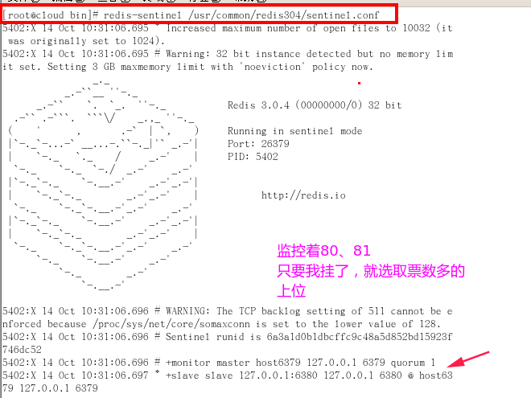

演示:

①一开始，`master`挂了。

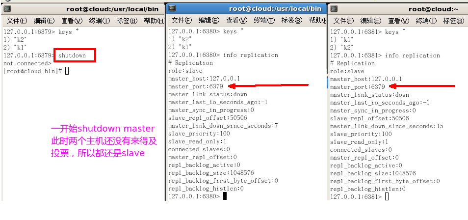

②查看`sentinel`文件内容变化。

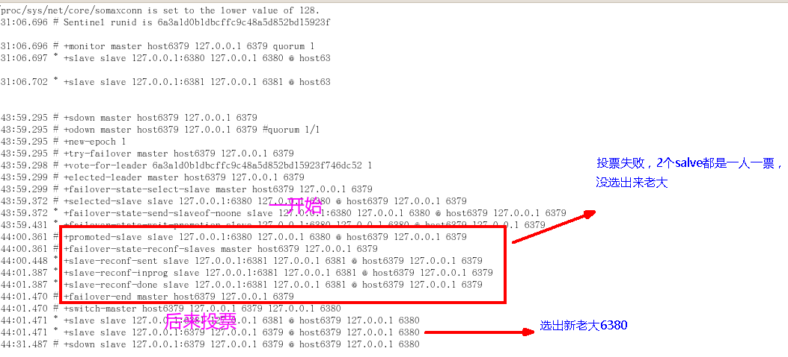

③重新看，`6780`已经自动成为了`master`。

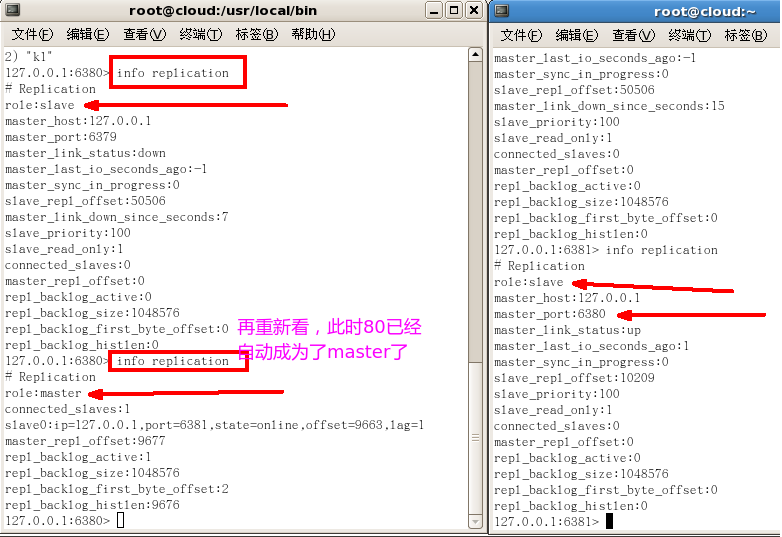

④如果之前的`master`即`6379`重启回来，会不会双`master`冲突？ 答：不会，之前的`master`变成现在的`master`的奴隶。

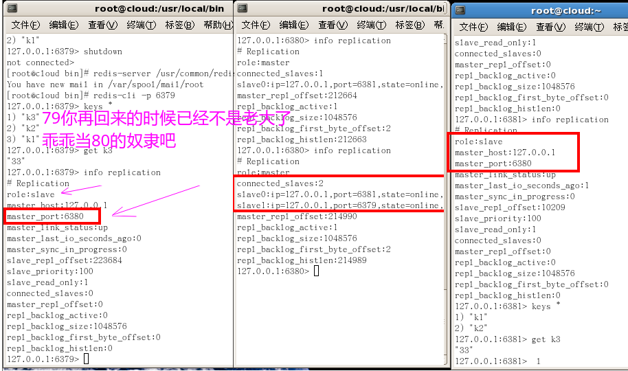

**在定时程序的调用链中，确实发现了哨兵主动连接 Redis 服务器的过程：**

> sentinelTimer()->sentinelHandleRedisInstance()->sentinelReconnectInstance()。

sentinelReconnectInstance() 负责连接被标记为 SRI_DISCONNECT 的 Redis 服务器。它对一个 Redis 服务器发起了两个连接：

* 普通连接（sentinelRedisInstance.cc,Commands connection）
* 订阅发布专用连接（sentinelRedisInstance.pc,publish connection）。为什么需要分这两个连接呢？因为对于一个客户端连接来说，redis 服务器要么专门处理普通的命令，要么专门处理订阅发布命令

**更为详细的哨兵的介绍：**
https://blog.csdn.net/lee_nacl/article/details/62044097
