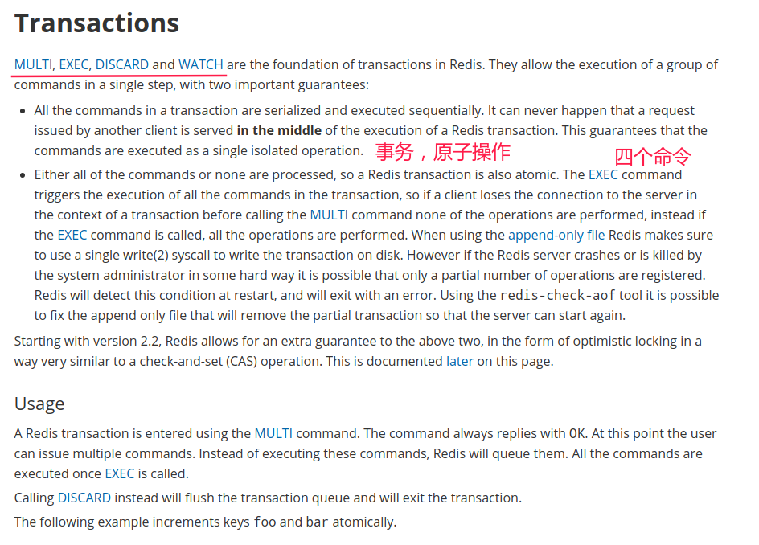
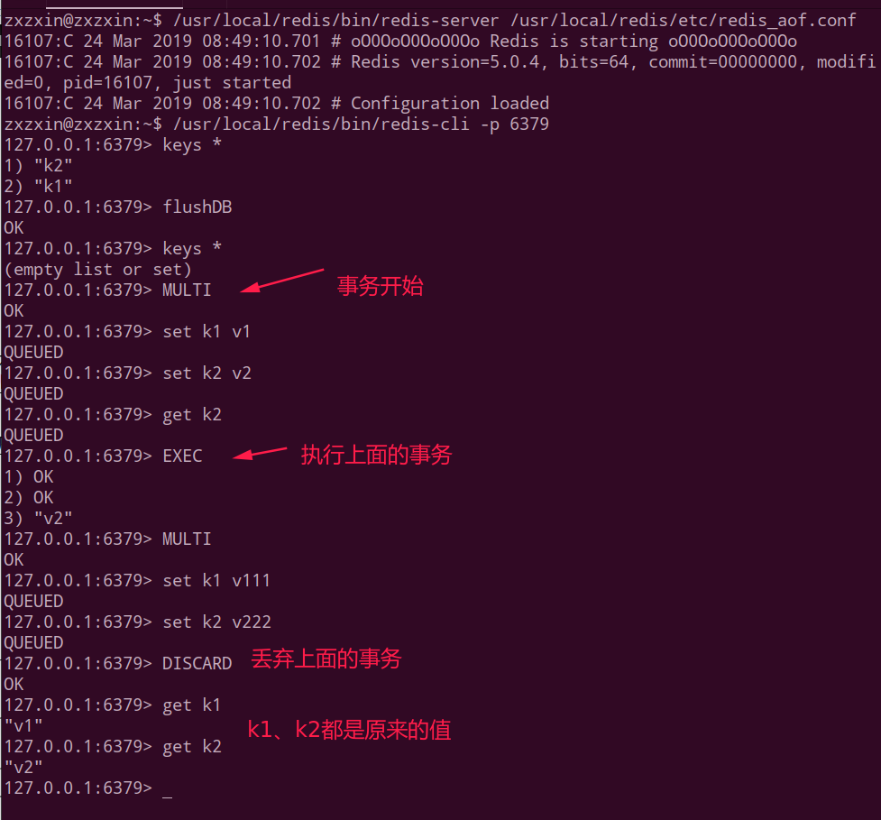
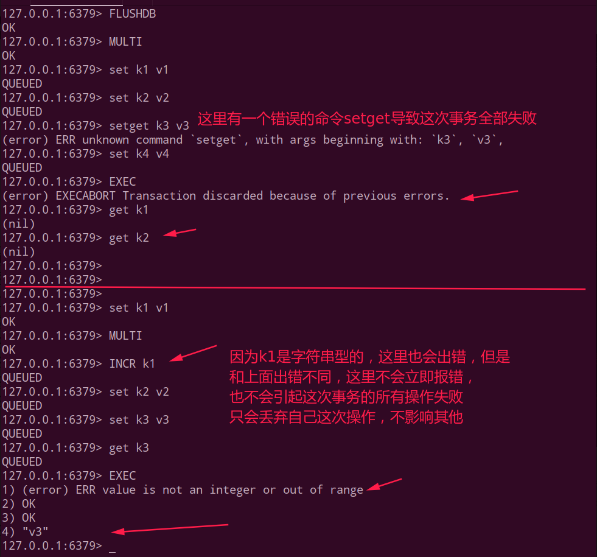
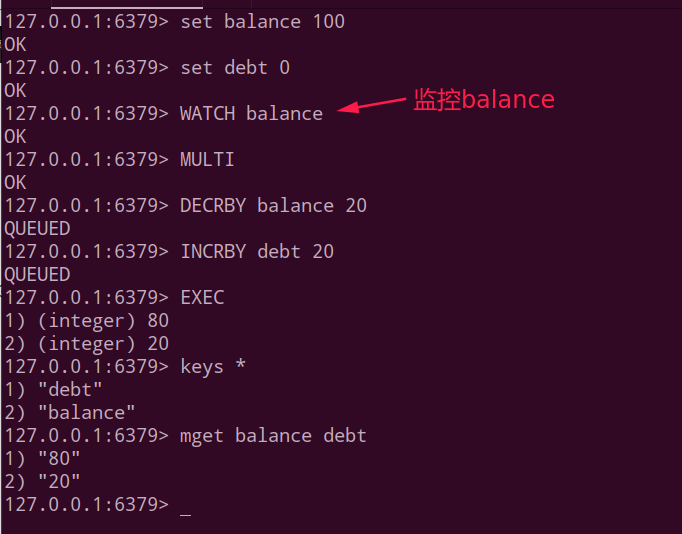
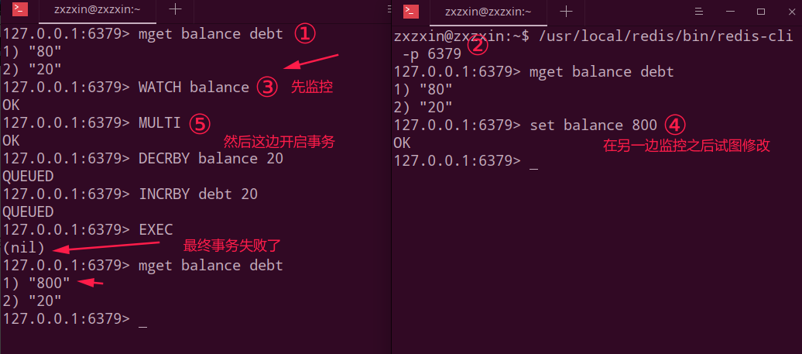
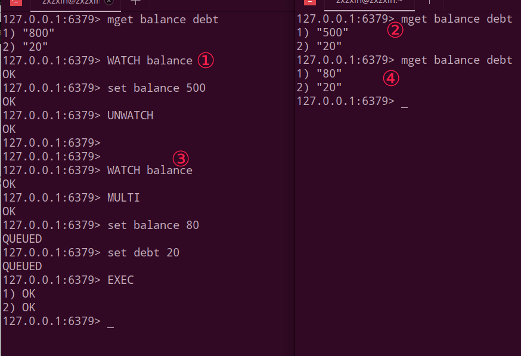
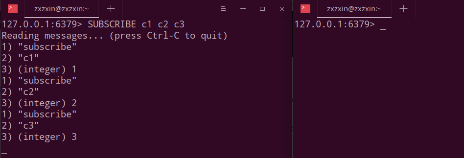
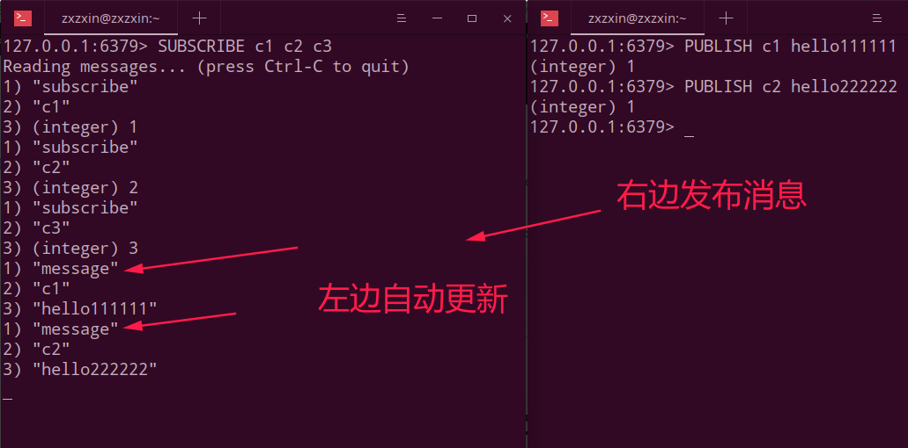

# Redis事务和消息订阅

## 一、Redis事务

### 1、概念

可以一次执行多个命令，本质是 **一组命令的集合**。一个事务中的 所有命令都会 **序列化，按顺序地串行化执行** 而不会被其它命令插入，不许加塞。

事务能做的事: **一个队列中，一次性、顺序性、排他性的执行一系列命令**

常用命令:

* DISCARD: 取消事务，放弃执行事务块内的所有命令；
* EXEC : 执行所有事务块内的命令；
* MULTI : 标记一个事务块的开始；
* WATCH key([key ....])   : 监视一个（或多个） key，如果在事务执行之前这个(或这些)key被其他命令所改动，那么事务将被打断；
* UNWATCH : 取消WATCH命令对**所有key**的监控；

### 2、正常执行和放弃事务

* 正常执行；
* 放弃事务；

### 3、全体连坐和冤头债主

下面的演示说明:  **Redis是部分支持事务的**。不保证原子性。

* 全体连坐 (错误的命令，相当于编译错误，然后导致所有命令都挂了)；
* 冤头债主(不支持的参数，或者类型问题，相当于运行时错误，不会导致所有命令都挂，只挂有问题的)；

### 4、WATCH监控(重要)

首先介绍了乐观锁和悲观锁:

* 悲观锁(`Pessimistic Lock`):  顾名思义，就是很悲观，每次去拿数据的时候都认为别人会修改，**所以每次在拿数据的时候都会上锁**，这样别人想拿这个数据就会block直到它拿到锁。传统的关系型数据库里边就用到了很多这种锁机制，比如行锁，表锁等，读锁，写锁等，都是在做操作之前先上锁。
* 乐观锁(`Optimistic Lock`) : 顾名思义，就是很乐观，每次去拿数据的时候都认为别人不会修改，所以不会上锁，**但是在更新的时候会判断一下在此期间别人有没有去更新这个数据，可以使用版本号(version)等机制**。乐观锁适用于多读的应用类型，这样可以提高吞吐量。 乐观锁策略:**提交版本必须大于记录当前版本才能执行更新**。

WATCH监控案例: （余额和消费），例如余额为`100`，消费为`0`，余额为`80`，消费为`20`.....

①先看一波正常执行的:

②第二波，有另一个客户端修改了我们`WATCH`的key。

③第三波，使用UNWATCH。

总结:

* 一旦执行了`exec`之前加的监控锁都会被取消掉了。
* Watch指令，类似乐观锁，事务提交时，如果Key的值已被别的客户端改变， 比如某个list已被别的客户端`push/pop`过了，整个事务队列都不会被执行。
* 通过WATCH命令在事务执行之前监控了多个Keys，**倘若在WATCH之后有任何Key的值发生了变化， EXEC命令执行的事务都将被放弃**，同时返回Nullmulti-bulk应答以通知调用者事务执行失败。

### 5、事务的阶段和特性

三个阶段:

* 开启：**以MULTI开始一个事务**；
* 入队：**将多个命令入队到事务中，接到这些命令并不会立即执行，而是放到等待执行的事务队列里面**；
* 执行：**由EXEC命令触发事务**；

三个特性:

* **单独的隔离操作**：事务中的所有命令都会序列化、按顺序地执行。事务在执行的过程中，不会被其他客户端发送来的命令请求所打断；
* **没有隔离级别的概念**：队列中的命令没有提交之前都不会实际的被执行，因为事务提交前任何指令都不会被实际执行， 也就不存在”事务内的查询要看到事务里的更新，在事务外查询不能看到”这个让人万分头痛的问题；
* 不保证原子性：**redis同一个事务中如果有一条命令执行失败，其后的命令仍然会被执行**，没有回滚；

## 二、Redis消息订阅发布

概念:

* 进程间的一种消息通信模式：发送者(pub)发送消息，订阅者(sub)接收消息；

左边窗口开始订阅`c1、c2、c3`三个频道。右边还没有操作。

然后右边开始发布消息。

总结:

先订阅后发布后才能收到消息，

* 可以一次性订阅多个，`SUBSCRIBE c1 c2 c3`。

* 消息发布，`PUBLISH c2 hello-redis`。

* 订阅多个，通配符`*`，`PSUBSCRIBE new*`。
* 收取消息， `PUBLISH new1 redis2015`。
