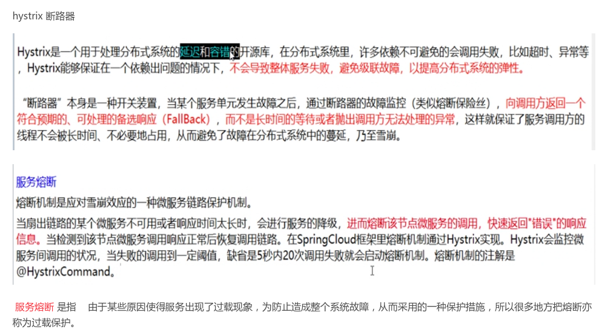

<https://www.cnblogs.com/jajian/p/9973555.html> 一篇SpringCloud的好文章。

Dubbo和Cloud区别:

* dubbo 是 基于 RPC 远程 过程调用
* cloud 是基于 http  rest api 调用

**而且REST相比RPC更为灵活,服务提供方和调用方的依赖只依靠一纸契约,不存在代码级别的强依赖,这在强调快速演化的微服务环境下,显得更加合适** 

###  如何设计一个高并发的系统

① 数据库的优化，包括合理的事务隔离级别、SQL语句优化、索引的优化

② 使用缓存，尽量减少数据库 IO

③ 分布式数据库、分布式缓存

④ 服务器的负载均衡

### 使用 Spring Cloud 有什么优势？

使用 Spring Boot 开发分布式微服务时，我们面临以下问题
1. 与分布式系统相关的复杂性- 这种开销包括网络问题，延迟开销，带宽问题，安全问题。
2. 服务发现- 服务发现工具管理群集中的流程和服务如何查找和互相交谈。它涉及一个服务目录，在该
目录中注册服务，然后能够查找并连接到该目录中的服务。
3. 冗余- 分布式系统中的冗余问题。
4. 负载平衡 --负载平衡改善跨多个计算资源的工作负荷，诸如计算机，计算机集群，网络链路，中央
处理单元，或磁盘驱动器的分布。
5. 性能- 问题 由于各种运营开销导致的性能问题。
6. 部署复杂性-Devops 技能的要求

### 负载平衡的意义什么？

在计算中，负载平衡可以改善跨计算机，计算机集群，网络链接，中央处理单元或磁盘驱动器等多种计算
资源的工作负载分布。负载平衡旨在优化资源使用，最大化吞吐量，最小化响应时间并避免任何单一资源
的过载。使用多个组件进行负载平衡而不是单个组件可能会通过冗余来提高可靠性和可用性。负载平衡通
常涉及专用软件或硬件，例如多层交换机或域名系统服务器进程。

使用负载均衡带来的好处很明显：

当集群里的1台或者多台服务器down的时候，剩余的没有down的服务器可以保证服务的继续使用
使用了更多的机器保证了机器的良性使用，不会由于某一高峰时刻导致系统cpu急剧上升
负载均衡有好几种实现策略，常见的有：

* 随机 (Random)

* 轮询 (RoundRobin)

* 一致性哈希 (ConsistentHash)

* 哈希 (Hash)

* 加权（Weighted)

组件: `ServerList`、`ServerListFilter`、`IRule`。

原理: 通过`ServerList`获取所有的可用服务列表。通过`serverListFilter`过滤一部分地址。最后通过`IRule`选择一个目标实例作为结果。

### Hystrix？它如何实现容错？

Hystrix 是一个延迟和容错库，旨在隔离远程系统，服务和第三方库的访问点，当出现故障是不可避免的
故障时，停止级联故障并在复杂的分布式系统中实现弹性。
通常对于使用微服务架构开发的系统，涉及到许多微服务。这些微服务彼此协作

简而言之: **就是去掉整个系统中的毒瘤**。

Hystrix的熔断状态机模型：

- 闭合（closed）状态： 对应用程序的请求能够直接引起方法的调用。**代理类维护了最近调用失败的次数，如果某次调用失败，则使失败次数加1。如果最近失败次数超过了在给定时间内允许失败的阈值(threshold reached)**，则代理类切换到断开(Open)状态。此时代理开启了一个超时时钟，当该时钟超过了该时间，则切换到半断开（Half-Open）状态。该超时时间的设定是给了依赖服务恢复正常。
- 断开(Open)状态：在该状态下，对依赖服务的请求会立即返回错误响应。
- 半断开（Half-Open）状态：**允许对应用程序的一定数量的请求可以去调用依赖服务。如果这些请求对依赖服务的调用成功，那么可以认为之前导致调用失败的错误已经修正，此时Circuit-Breaker切换到闭合状态，并且将错误计数器重置**；如果这一定数量的请求有调用失败的情况，则认为导致之前调用失败的问题仍然存在，Circuit-Breaker切回到断开方式，然后开始重置计时器来给依赖服务一定的时间来修正错误。半断开状态能够有效防止正在恢复中的依赖服务被突然而来的大量请求再次拖垮。

 什么是服务降级 微服务的优缺点分別是什么?

 用 通俗易懂的来说  ： 整体资源快不够了，忍痛将某些服务先关掉，待渡过难关，再开启回来。

### 什么是 Spring Cloud Bus？我们需要它吗？

考虑以下情况：我们有多个应用程序使用 Spring Cloud Config 读取属性，而 Spring Cloud Config 从
GIT 读取这些属性。
下面的例子中多个员工生产者模块从 Employee Config Module 获取 Eureka 注册的财产。
如果假设 GIT 中的 Eureka 注册属性更改为指向另一台 Eureka 服务器，会发生什么情况。在这种情况
下，我们将不得不重新启动服务以获取更新的属性。
还有另一种使用执行器端点/ 刷新的方式。但是我们将不得不为每个模块单独调用这个 url。例如，如果
Employee Producer1 部署在端口 8080 上，则调用 http： // localhost： 8080 / refresh。同样对于
Employee Producer2 http： // localhost： 8081 / refresh 等等。这又很麻烦。这就是 Spring Cloud
Bus
